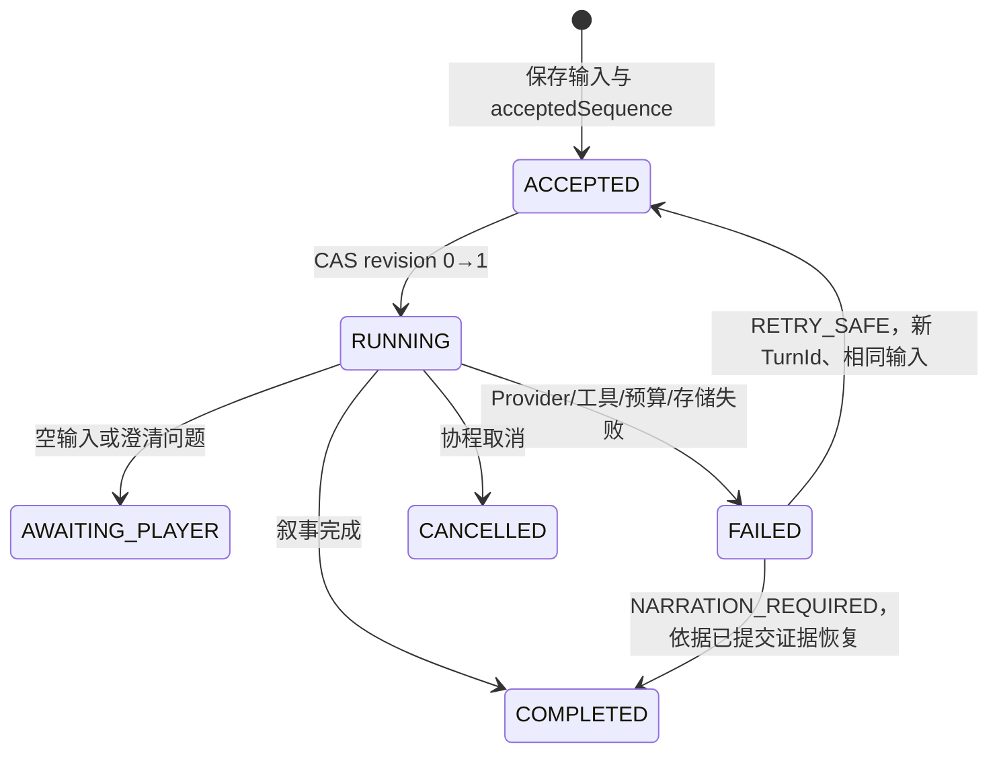

# Worldloom 代码架构与 Agent 主循环学习指南

> 本文面向第一次接触 Agent 工程的开发者，描述**当前仓库已经实现的代码**，而不是远期设想。
> 阅读时建议同时打开 `shared/agent-runtime`、`shared/application`、`shared/domain-world` 和
> `shared/provider-api`。产品级约束仍以 [DESIGN.md](DESIGN.md) 和 Accepted ADR 为准。

## 1. 先建立正确的 Agent 心智模型

Worldloom 的 Agent 不是“一个可以随意改游戏对象的 AI”。它是一个在受控循环中反复做两种选择的语言模型：

1. 返回最终文本；
2. 请求调用宿主提供的工具，读取工具结果后继续推理。

语言模型只负责理解意图、选择工具和组织叙事。世界事实由确定性代码裁决：

```text
玩家自然语言
  → GameTurnOrchestrator（持久化回合、投影上下文）
  → AgentRuntime（模型/工具循环）
  → AgentToolGateway（权限、Schema、动态 ID 校验）
  → GameSessionCommand（类型化命令）
  → CommandValidator → WorldEngine/RuleEngine
  → EventStore → Reducer → GameState
  → 工具结果返回模型 → 最终叙事
```

这里有两个必须分开的循环：

- **Agent 循环**解决“下一步说话还是调用工具”；其输出带概率，不能作为事实。
- **世界循环**解决“命令是否合法、发生了什么、状态如何变化”；它必须确定、可回放、可审计。

因此，Agent 说“你获得了钥匙”不等于玩家真的获得钥匙。只有工具生成的命令被接受、事件写入
`EventStore` 并被 Reducer 投影后，这才是事实。这是理解本项目设计的钥匙。

## 2. 工程地图与依赖方向

`settings.gradle.kts` 中的实际模块可以按职责归为六组：

| 层 | 主要模块 | 当前职责 |
|---|---|---|
| 平台入口 | `apps:androidApp`、`apps:desktopApp`、iOS Xcode 宿主 | 依赖注入、窗口/生命周期、启动 Compose |
| UI 与用例 | `shared:ui-game`、`shared:application` | UI 状态、世界加载、命令提交、展示投影 |
| Agent | `shared:agent-runtime` | 主循环、主持回合、NPC、工具网关、记忆与压缩 |
| Provider | `shared:provider-api`、`shared:provider-openai` | 供应商中立协议、OpenAI HTTP/SSE 转换 |
| 确定性内核 | `definition-runtime`、`domain-world`、`domain-rules`、规则模块 API/Registry | Definition、Command/Event、验证、规则、Reducer、随机记录 |
| 内容与存储 | `world-package`、`behavior-runtime`、`content-*`、`persistence`、`secure-vault` | 世界包、受限 AST、草稿生成、SQLDelight、密钥 |

值得注意的依赖规则：

- `provider-api` 不认识游戏领域；它只描述消息、工具、用量、能力和错误。
- `agent-runtime` 依赖 Provider 抽象，并通过 `application` 操作世界，不直接写状态。
- `application` 组合世界内核、规则、世界包和 Behavior Runtime，是权威用例边界。
- `provider-openai` 只把中立 DTO 转成 OpenAI 协议；领域代码不依赖供应商 DTO。
- KMP `commonMain` 不引入 Android Context、JVM 文件 API 或 Apple Framework。

`persistence` 需要实现 Agent Runtime 声明的 Store 接口，因此构建图上会看到它依赖
`agent-runtime`；运行时则由应用入口把 SQLDelight 实现注入接口。这是“接口所有权”与“运行时调用方向”
不同的典型例子，不应误读为持久化层主持 Agent 循环。

## 3. 三类状态：不要混为一谈

### 3.1 权威世界状态

`EventStore` 保存已发生事件，`GameState` 是事件经 Reducer 得到的投影。命令携带 Run、Actor、
期望序列和类型化 Payload；校验器检查权限、引用和当前状态；规则引擎生成事件；Reducer 只消费事件。
随机判定通过 `RandomService` 生成 `RandomRecord`，回放时复用记录，而不是重新掷骰。

### 3.2 Agent 会话

`AgentSessionSnapshot` 保存供应商对话消息，并绑定：

- `AgentSessionId`；
- 所有者 `AgentId`；
- 所有者 `ActorId`；
- 可选 `RunId`；
- 乐观锁 `revision`。

加载和保存都验证所有权；保存要求 revision 匹配。这同时阻止 NPC 之间串线、跨存档串线和并发覆盖。
`AgentRuntime` 只有在得到最终文本后才发布整个归档对话；工具已经提交、但最终叙事失败时，则通过
`worldChanged` 明确告诉上层世界可能已经变化。

### 3.3 Agent 长期记忆与公开连续性

`AgentMemoryStore` 分开保存原始回合、结构化记忆和 `ContextCheckpoint`。它们是上下文材料，不是世界事实。
GM 连续性只从持久化终态回合和公开事件修复生成；NPC 记忆按 `AgentId` 分区。任何摘要与当前
Presentation 冲突时，都必须以当前权威投影为准。

## 4. Provider 抽象：先隔离模型供应商

`ProviderApi.kt` 定义最小供应商中立协议：

- `ProviderMessage`：SYSTEM、USER、ASSISTANT、TOOL 四种角色；
- `ProviderToolDefinition`：工具名、描述、参数类型和允许值；
- `ProviderToolCall`：模型生成的调用 ID、名称和 JSON 参数；
- `ProviderTurn`：文本、零到多个工具调用和用量；
- `ProviderCapabilities`：tool calling、streaming、structured output；
- `ProviderResult`：结构化成功或失败；
- `LanguageModelProvider` / `StreamingLanguageModelProvider`：一次完成与流式完成。

主循环只依赖这些接口。OpenAI Adapter 负责认证、请求 JSON、响应/SSE 解析、错误映射和能力声明。
这样做的价值不是“以后换模型”这一句空话，而是让循环能够基于能力显式退化：如果当前回合提供了工具，
但 Provider 不支持 tool calling，Runtime 在发送请求前就失败，而不是期待模型用自然语言模拟工具。

## 5. `AgentRuntime`：最小而完整的主循环

### 5.1 输入和策略

`AgentRunRequest` 包含身份、Session、用户输入、System Prompt、可选压缩上下文和 Run。
`AgentRunPolicy` 同时限制：

- 最大模型步骤数；
- 最大工具调用数；
- 总超时；
- 输入/输出 Token；
- 成本微单位；
- 单步最大输出 Token。

生产 Agent 不能只设 `while (true)`。网络重试、模型反复调用同一工具、输出膨胀和并发会话都可能失控；
这些限制构成循环的资源保险丝。

### 5.2 逐步算法

主循环可以用下面的伪代码理解：

```kotlin
withTimeout(policy.timeoutMillis) {
    snapshot = sessionStore.load(sessionId, identity, runId)
    tools = gateway.availableTools(identity)
    conversation = compactedContext ?: snapshot.messages
    archive = snapshot.messages
    conversation += user(input)
    archive += user(input)

    while (true) {
        checkStepAndRemainingBudgets()
        turn = provider.complete(systemPrompt + conversation, tools)
        accumulateAndCheckReportedUsage(turn.usage)

        if (turn.toolCalls.isEmpty()) {
            requireFinalText(turn)
            sessionStore.save(archive + assistant(turn.text), snapshot.revision)
            return Completed(...)
        }

        validateWholeBatchBeforeSideEffects(turn.toolCalls)
        conversation += assistant(toolCalls)
        archive += assistant(toolCalls)
        for (call in turn.toolCalls) {
            result = gateway.invoke(identity, call)
            conversation += tool(result)
            archive += tool(result)
        }
    }
}
```

关键点不是循环语法，而是每一步的边界：

1. **先加载并锁定身份语义**：Session/Agent/Actor/Run 任一不匹配都拒绝。
2. **每回合动态列工具**：工具由当前世界 Manifest、状态和权限共同决定，不是静态万能列表。
3. **System Prompt 每次请求置顶**：事实投影不依赖模型过去是否记住。
4. **先验证整批工具，再执行第一个**：避免批次后半有非法调用、前半却已产生副作用。
5. **调用 ID 必须唯一**：保证 TOOL 消息能可靠对应 ASSISTANT 请求。
6. **相同名称+规范化参数禁止重复**：用签名检测当前回合内的工具死循环。
7. **逐次累计 Provider 报告用量**：在下一步前收紧剩余输出额度，并在响应后检查总预算。
8. **异常与取消不同**：协程取消继续抛出；普通 Provider 异常映射为结构化失败。
9. **保留 `worldChanged`**：模型后续失败不能回滚已经提交的世界事件。
10. **最终用乐观锁发布 Session**：并发更新不会静默覆盖。

### 5.3 流式输出的真实语义

若 Provider 同时实现流式接口并声明 streaming，Runtime 把 `TextDelta` 传给 UI 回调；完整响应仍由 Provider
返回并参加校验、存档和终态判断。Delta 是临时显示，不是事实，也不应直接当作最终历史。调用方应能在失败、
取消或工具调用后修正临时文本。

### 5.4 失败并不都能“重试”

Runtime 的失败包含 `worldChanged`。如果失败发生在任何工具提交之前，可以安全地用同一输入重试；如果事件已经
提交，再执行同一行动可能重复扣资源或推进时间，此时只能基于已经提交的证据补写叙事。这一语义由上层
`GameTurnOrchestrator` 固化为 `RETRY_SAFE` 或 `NARRATION_REQUIRED`。

## 6. Tool Gateway：让模型建议行动，让应用裁决行动

`DefaultAgentToolGateway` 是 Agent 与权威世界之间唯一的写边界。一次调用经历：

```text
工具是否已注册
 → 当前世界 Manifest/模块是否启用
 → AgentIdentity 是否拥有 CommandPermission
 → JSON 参数类型、必填项、枚举和额外字段校验
 → Definition/Entity/场景等动态 ID 是否在当前投影可用
 → 映射为 GameSessionCommand
 → GameSession.execute(command, SessionCommandContext/Authorization)
 → 返回面向模型的结果与 worldChanged
 → 必要时派发确定性 Behavior 和可见 NPC follow-up
```

当前标准工具覆盖数值调整、判定、场景行动、时间/活动/旅行、库存、状态、关系、任务、进度钟，以及 NPC
说话、行动和被玩家点名。工具名本身采用稳定命名空间 ID。

为什么需要在 Gateway 再校验一次？因为 Tool Schema 是给模型的提示和协议描述，不是安全机制。模型可能输出
不存在的 ID、越权工具、额外参数或畸形 JSON；Provider 也可能错误解析。所有外部输出都必须当作不可信输入。

工具返回后触发的 `GameTurnFollowUpDispatcher` 也不能直接改状态。Behavior 或 NPC 后续动作必须走自己的权威
命令网关。这样一次复杂回合仍能追溯到连续的类型化事件。

## 7. GM 回合编排：主循环外还需要可靠性外壳

`GameTurnOrchestrator` 解决的是一次玩家回合的生命周期，而 `AgentRuntime` 只解决一次模型工具循环。
二者不要合并，否则恢复、历史、UI 和模型协议会纠缠。

### 7.1 回合状态机



每个 `GameTurn` 记录 `acceptedSequence` 和 `deliveredSequence`，从而知道 Agent 执行期间是否出现新事实。
Turn Store 同样用 revision CAS，TurnId 重用但输入不同会被拒绝。对相同 TurnId 的重复请求返回或恢复原回合，
为 UI 重组、进程恢复和重复点击提供幂等基础。

### 7.2 正常主持流程

1. 读取 `SessionCommandContext` 和当前 `GamePresentation`；
2. 持久化 `ACCEPTED`，再 CAS 到 `RUNNING`；
3. 从终态公共历史修复 GM 连续性；
4. `GmContextProjector` 只把玩家可见 Presentation、公开事件、已揭示知识和连续性写入 Prompt；
5. 创建 GM 的稳定 Identity、Session 和权限，调用 `AgentRuntime`；
6. 根据结果保存 narration、clarification、failure 或 cancellation；
7. 后台安排连续性压缩，但压缩失败不阻塞游戏。

### 7.3 为什么 Prompt 是投影，不是数据库转储

Prompt 明确列出当前场景、行动、字段、时间、活动、路线、公开库存/状态/关系/任务/进度钟和最近公开事件。
它不读取隐藏世界事实，也不把世界包任意键直接交给模型。这样既减少上下文，又使“Agent 能知道什么”成为可测试
的投影规则。连续性摘要被标注为非权威，防止旧摘要盖过新事件。

### 7.4 取消与部分提交

协程取消时，Orchestrator 在 `NonCancellable` 区域尽力写入终态，再继续抛出取消。它重新读取事件序列：若序列
前进，标记 `NARRATION_REQUIRED`；否则标记 `RETRY_SAFE`。这是结构化并发和事件溯源结合的实用模式：
取消网络任务，不等于撤销已经落库的事实。

## 8. NPC Agent：隔离身份、感知和调度

NPC 不是共享一个“群聊 Agent”。每个 `NpcAgentProfile` 有稳定 Agent/Actor/Entity/Session、角色 Prompt、权限、
唤醒策略和优先级。`NpcPerceptionProjector` 为该 NPC 构建私有感知；`AgentContextBuilder` 只能读取同一
`AgentId` 分区的检查点、回合和记忆。

`NpcAgentScheduler` 只唤醒相关 NPC，并用确定顺序处理候选；`NpcSceneDispatch` 将公开 NPC 结果接回当前场景。
这种设计防止：

- NPC A 读取 NPC B 的私有记忆；
- 模型从全量 WorldState 得知未感知秘密；
- 并发 NPC 以不稳定完成顺序影响规则结果；
- NPC 直接修改状态而绕过命令权限。

给初学者的经验是：多 Agent 的核心不是“同时启动更多模型”，而是明确每个 Agent 的**身份、可见信息、工具权限、
持久化分区和确定性调度规则**。

## 9. 记忆与上下文压缩

### 9.1 数据模型

- `AgentTurnRecord`：不可丢失的原始输入/输出、Token 估算和来源事件；
- `AgentMemoryRecord`：语义、情节、关系等结构化记忆，带显著度、置信度、标签和来源；
- `ContextCheckpoint`：覆盖连续 sequence 区间的摘要，带 Prompt/模型版本和幂等键；
- `CompactionPublication`：检查点和记忆的原子发布单元。

### 9.2 压缩协调器

`AgentCompactionCoordinator` 根据软/硬水位、未压缩回合数、Token 数和显式检查点请求决定是否运行。每个 Agent
最多一个活跃任务；新请求合并到 queued 请求，避免压缩风暴。它保留一段最近原文，将更早的冻结区间交给模型，
候选只有满足以下条件才发布：

- 覆盖区间与输入首尾 sequence 完全一致；
- 摘要非空；
- 所有记忆仍属于当前 Agent；
- 引用的事件 ID 是输入来源事件的子集；
- Store 原子、幂等地发布检查点与记忆。

压缩异常被隔离，不能覆盖 EventLog，也不能阻塞正常回合。GM 当前使用确定性的公开连续性压缩器；其摘要只是
叙事辅助。这个设计避免了常见错误：让 LLM 摘要成为唯一历史，最终因幻觉或遗漏永久篡改事实。

## 10. 世界执行链与 Agent 的关系

`DefaultGameSession` 组合世界包校验、初始状态、持久化 EventStore、命令验证器、规则引擎和 Reducer 链。
Agent 工具最终只得到 `GameSessionCommand`；Application 再根据当前 Run 构造 Command Envelope 和 Authorization。

世界变化遵循三个阶段：

1. **Validate**：Schema 版本、Actor 权限、期望事件序列、Definition 引用和数值边界；
2. **Decide**：World/Rule Engine 依据验证后的命令和显式随机记录产生事件；
3. **Apply**：Event Store 追加事件，Reducer 生成新 `GameState`，Presentation Mapper 生成只读 UI/Agent 投影。

Behavior Runtime 是经验证 AST 的确定性后续规则，不执行世界包携带的 Kotlin/JS/Lua。规则模块由 Manifest 明确启用；
因此工具列表和能力随世界配置变化，而 Runtime 不根据 `worldId` 或题材写分支。

## 11. 一次完整回合示例

假设玩家输入“去医务室，并使用一份绷带”：

1. Controller 分配 `TurnId`，Orchestrator 保存输入和当前事件序列 42。
2. Projector 告诉模型当前位置、可用路线和公开库存；Gateway 只提供当前可用工具。
3. 模型调用 `worldloom.tool.travel.perform(routeId=...)`。
4. Gateway 校验路线确实公开可用、GM 有权限，映射为 `Travel` 命令。
5. Session 验证命令，规则引擎记录耗时/可能的随机结果，事件追加到 43..45，Reducer 更新场景和时间。
6. 工具结果作为 TOOL 消息返回模型。Prompt 本轮不会自动重建，但工具输出提供刚提交结果。
7. 模型再调用库存工具；Gateway 基于**最新 Session 状态**重新校验并提交事件 46。
8. 模型返回叙事；Session 对话以 revision CAS 保存，Turn 以 deliveredSequence=46 完成。
9. UI 从 Presentation 展示结果；后台连续性稍后从终态 Turn 和公开事件修复。

如果第 7 步后网络断开，Turn 是失败但 `worldChanged=true`。UI 应提供“恢复叙事”，而不是重新执行原输入。

## 12. 从零实现 Agent 时可复用的最小路线

不要一开始做多 Agent、向量数据库或复杂规划器。建议按以下竖切递增：

1. 定义供应商中立的 Message、Tool、Result、Usage 和 Capability。
2. 实现“无工具时一次模型调用返回文本”，加超时与结构化错误。
3. 添加一个只读工具，完成 ASSISTANT tool call → TOOL result → 再调用模型。
4. 添加有副作用工具，但工具只生成类型化 Command，由确定性领域层执行。
5. 加工具 Schema、权限、动态引用校验和整批预验证。
6. 加步骤/调用/Token/成本限制与重复调用检测。
7. 加 Session 所有权、Run 绑定、revision CAS 和持久化。
8. 加 Turn 状态机、幂等 TurnId、取消和部分提交恢复。
9. 最后才加流式 UI、NPC、长期记忆和异步压缩。

每一阶段都用 Fake Provider 编写确定性测试。Fake 依次返回预设的 tool calls 和 final text，可以精确断言模型收到的
消息、开放的工具、工具顺序、预算和失败恢复，无需真实网络和费用。

## 13. 测试如何证明设计成立

重点测试分布如下：

- `AgentRuntimeTest`：主循环、能力、预算、重复调用、批量预验证、流式、Session 冲突和错误映射；
- `GameAgentControllerTest` / `GameTurnOrchestratorContractTest`：状态机、历史、重试、叙事恢复和 UI 协作；
- `NpcAgentTest` / `NpcSceneOrchestratorContractTest`：NPC 感知、分区、唤醒和公开动作；
- `ContractAgentToolTest`：两个不同题材世界共享同一 Tool→Command→Event 链；
- `OpenAiAgentVerticalSliceTest`：真实 Adapter 形状贯通 Agent 和应用层，但用可控 HTTP 测试设施；
- `SqlDelightAgentSessionStoreTest` / `SqlDelightAgentMemoryStoreTest`：所有权、CAS、检查点和持久化语义；
- `AlphaJourneySystemTest`：更大的候选用户旅程。

新增 Agent 能力时，优先证明失败路径：越权、未知 ID、重复 tool call、Provider 无能力、预算耗尽、保存冲突、工具已
提交后失败、取消、跨 Agent/Run 读取。成功路径通常最简单，生产事故更多发生在这些边界组合上。

## 14. 当前实现的设计取舍与边界

- Agent Runtime 串行执行同一响应中的工具调用，换取稳定顺序和清晰的部分提交语义。
- Orchestrator 用 Mutex 串行化主持回合，先保证单人游戏一致性，而非追求并发吞吐。
- 工具参数类型目前是有限集合，复杂对象需扩展 Provider Schema 抽象，不能绕过校验塞入任意 JSON。
- GM 的公开连续性压缩目前是确定性摘要器，不是供应商特定智能总结；这是可替换的保守实现。
- Session 只在完整终答时发布；工具事件独立持久化，所以对话存档与世界事实采用不同一致性边界。
- `worldChanged` 是恢复判断的快速信号，Orchestrator 还比较事件序列，避免仅信任组件自报。
- 设计面向单人本地游戏；若未来允许多个并发主持者，需要重新审视锁粒度、命令预期序列和冲突 UX。

## 15. 推荐源码阅读顺序

1. `shared/provider-api/.../ProviderApi.kt`：理解模型协议。
2. `shared/agent-runtime/.../AgentModel.kt`：理解请求、策略和结果。
3. `shared/agent-runtime/.../AgentRuntime.kt`：逐行跟主循环。
4. `shared/agent-runtime/.../ToolGateway.kt`：看不可信 JSON 如何变成权威命令。
5. `shared/application/.../GameSessionModel.kt` 与 `DefaultGameSession.kt`：看命令如何进入世界。
6. `shared/domain-world/.../WorldEngine.kt`、Command/Event/Reducer：看确定性内核。
7. `shared/agent-runtime/.../GmTurnOrchestrator.kt`：看可靠性外壳和 Prompt 投影。
8. `NpcAgent.kt`、`NpcSceneDispatch.kt`：看多 Agent 隔离。
9. `AgentMemory.kt`、`AgentCompaction.kt`、`GmContinuity.kt`：看非权威记忆。
10. 对应测试：从 Fake 场景反向验证每条约束。

## 16. Code review 检查表

提交 Agent 相关改动前逐项确认：

- [ ] 模型输出是否始终被视为不可信输入？
- [ ] 所有事实变化是否走 Tool → typed Command → Event → Reducer？
- [ ] 工具是否同时检查注册、启用、权限、Schema 和动态引用？
- [ ] 是否存在步骤、工具、时间、Token 和成本上限？
- [ ] 工具已经提交后失败，是否避免自动重放？
- [ ] Session 是否绑定 Agent、Actor、Run，并用 revision 防覆盖？
- [ ] NPC 上下文是否只包含该 NPC 可感知和该分区记忆？
- [ ] 摘要是否明确非权威、可重建且原子发布？
- [ ] 随机结果是否被记录并在回放时复用？
- [ ] Provider DTO、密钥和完整私有上下文是否留在正确边界？
- [ ] 流式 Delta 是否只作临时展示，而非历史或事实？
- [ ] 新逻辑是否有 Fake Provider 的成功与失败测试？

做到这些，Agent 就不再是一段难以控制的 Prompt 魔法，而是一个可以测试、审计、恢复和逐步替换的应用组件。
