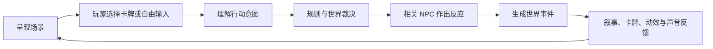
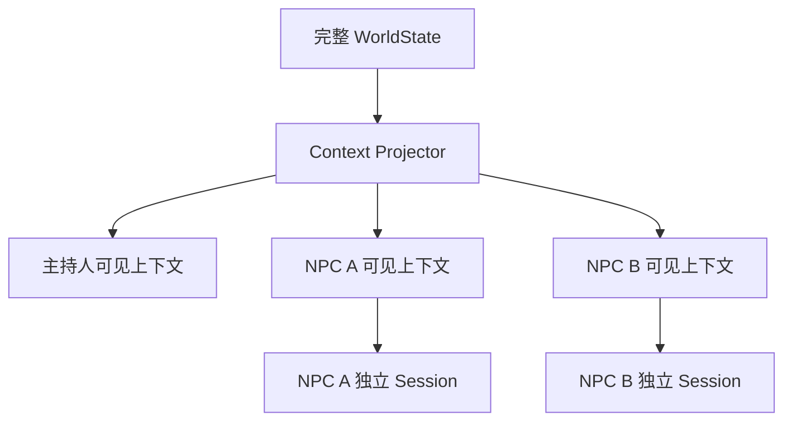
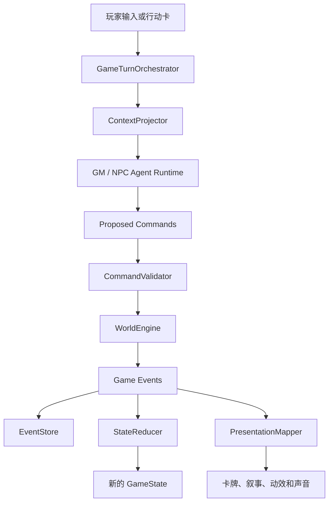

# Worldloom 项目设计文档

文档状态：Draft 0.1  
更新日期：2026-08-17

## 1. 产品定义

Worldloom（织境）是一款由 Agent 驱动、由确定性规则引擎裁决、以卡牌和动效呈现的单人叙事 RPG。

玩家面对的不是一棵固定剧情树，而是一个拥有客观状态、角色认知、时间和因果关系的世界。玩家可以用自然语言或行动卡声明意图，系统将意图转化为规则命令，结算后再由主持人 Agent 把玩家能够感知的结果组织成叙事。

产品核心不是“AI 聊天”，而是以下四者的组合：

```text
可计算的世界
+ 有信息边界的 Agent 角色
+ 可验证的规则与事件
+ 有游戏感的卡牌和视听反馈
```

### 1.1 产品支柱

1. **自由行动**：玩家可以描述未被预设按钮覆盖的行动。
2. **世界可信**：门、物品、人物、时间和秘密都具有稳定状态。
3. **角色独立**：重要 NPC 拥有自己的知识、记忆、目标和行动权限。
4. **失败推进**：失败产生代价与新局面，而不是让游戏停住。
5. **表现可读**：规则与状态变化通过卡牌、动效和声音明确反馈。
6. **内容可扩展**：同一引擎能够加载不同题材的 `.worldloom` 世界包。

### 1.2 首要平台

| 平台 | 优先级 | 首版目标 |
|---|---:|---|
| Windows Desktop | P0 | 快速迭代、世界工坊和完整试玩 |
| Android | P0 | 主要移动游戏平台 |
| iOS | P1 | 与 Android 共用核心逻辑和大部分 UI |
| macOS / Linux | P2 | 复用 Desktop 目标，完成打包验证 |

### 1.3 首版非目标

- 多人在线跑团；
- 完整 D&D、COC 等重规则复刻；
- 实时 3D 地图与物理战斗；
- 每个路人 NPC 都运行独立 Agent Loop；
- 无限自动生成且未经验证的开放世界；
- 首版社区市场、支付和内容审核系统。

## 2. 核心游戏循环



一次行动必须经历四个不同阶段：

1. **Intent**：玩家想做什么、想达成什么；
2. **Command**：系统把意图转化为受约束的行动请求；
3. **Event**：世界引擎确认实际发生的事实；
4. **Presentation**：表现层把事实变成玩家可见的叙事和动画。

语言模型不能跳过 Command 与 Event，直接宣称世界已经改变。

### 2.1 判定原则

只有在“结果不确定”且“失败有意义”时进行判定。

首版使用四属性与 2d6 三档结果：

```text
10+    完全成功
7–9    成功但付出代价
6-     失败并产生新的局面
```

骰子、修正值和资源变化由本地规则代码产生。Agent 负责解释结果，不负责虚构随机数。

### 2.2 推进动力

- 玩家目标；
- 核心线索与可选线索；
- 危险时钟；
- NPC 目标与计划；
- 时间、生命、物品、信任等资源；
- 不可逆或代价高昂的选择。

## 3. 游戏功能

### 3.1 世界书库

- 浏览内置与导入世界；
- 世界封面、题材、规则、预计时长和内容提示；
- 多存档、多周目、已发现结局；
- 世界版本兼容与存档迁移；
- 导入和导出 `.worldloom` 包。

### 3.2 角色创建

- 身份、背景、四项属性；
- 特质、弱点和初始物品卡；
- 世界提供的角色限制；
- AI 生成草稿，规则层验证最终数据。

### 3.3 主游戏

- 场景与叙事时间线；
- 行动卡和自然语言输入；
- 对话、调查、移动、战斗、交易与使用物品；
- 角色、背包、线索、任务、关系和时钟面板；
- 自动存档、事件回顾和分支存档；
- 模型响应期间保持界面、环境和取消操作可用。

### 3.4 世界工坊

- 创建场景、NPC、物品、线索、任务和时钟；
- 编辑世界规则和卡牌表现；
- AI 辅助生成内容草稿；
- 引用、权限、知识泄露和不可达路线检查；
- Fake Agent 模拟与快速试玩；
- 打包、升级和导出世界。

### 3.5 回放与开发者模式

- 查看每回合工具调用与规则判定；
- 查看世界引擎接受或拒绝的命令；
- 查看被唤醒的 Agent，但默认隐藏 NPC 私有内容；
- 从检查点重放或创建分支；
- 世界作者可开启完整因果链调试。

## 4. 卡牌与动效设计

卡牌是 Worldloom 的主要交互语言，不是单纯装饰。

### 4.1 卡牌类型

| 卡牌 | 用途 |
|---|---|
| 场景卡 | 地点、天气、时间和可交互对象 |
| NPC 卡 | 公开身份、情绪、关系和当前外部行为 |
| 行动卡 | 行动方式、消耗、风险和预期目标 |
| 判定卡 | 属性、加成、骰子、结果与代价 |
| 物品卡 | 数量、状态、能力和使用条件 |
| 线索卡 | 已知事实、来源、可信度和关联 |
| 时钟卡 | 威胁、仪式、追兵和持续事件 |
| 结果卡 | 获得、失去、受伤、关系和剧情变化 |

### 4.2 卡牌数据边界

Agent 只产生语义结果，不能产生任意 UI 代码：

```kotlin
data class PresentationCue(
    val semantic: CueSemantic,
    val subjectId: String?,
    val intensity: Int,
    val mood: Mood,
    val visibility: Visibility,
)
```

表现映射示例：

```text
CLUE_REVEALED
→ 线索卡翻面
→ 金色丝线连接相关节点
→ 播放揭示音效
→ 线索板写入新关系
```

### 4.3 视觉语言

默认方向：深色织物、低饱和场景、金色命运丝线、局部高亮的卡牌边框。

动效节奏遵循“平时克制、关键事件集中释放”：

- 常驻：呼吸、雾、烛火和低密度粒子；
- 操作：卡牌抬升、拖拽、弹回、翻面；
- 规则：骰子、血条、护盾、资源和时钟反馈；
- 叙事：线索揭示、场景重新编织和结局转场。

必须提供减少动态效果、30 FPS、省电和跳过长动画选项。

## 5. Agent 设计

### 5.1 主持人 Agent

主持人是导演、叙述者和调度者，不是所有角色的共同大脑。

职责：

- 理解玩家意图；
- 判断是否需要规则检查；
- 请求骰子和世界查询；
- 调度相关 NPC；
- 组织玩家可见结果；
- 控制场景节奏。

主持人不得直接决定 NPC 的私有想法，也不得直接修改世界状态。

### 5.2 普通 NPC Actor

普通 NPC 使用一次模型调用：

```text
固定设定
+ 私有知识
+ 运行时状态
+ 当前可见观察
+ 玩家行为
→ 台词、表情、情绪和行动意图
```

它不是完整 Agent，不主动持续运行。

### 5.3 关键 NPC Agent

少数重要角色拥有事件触发式独立 Session：

- 私有目标、记忆和工具；
- 基于自己的感知投影接收信息；
- 可以在玩家不在场时提出行动；
- 与主持人复用 Agent Loop 实现，但绝不共享上下文；
- 多角色并发意图由世界引擎统一结算。

### 5.4 织境 Agent

织境 Agent 只在世界工坊中辅助创作：

- 创建和修改世界草稿；
- 补全场景与角色；
- 运行内容验证；
- 模拟可能路线。

正式游戏期间不能使用作者权限修改不可变的 WorldDefinition。

### 5.5 感知与信息隔离



NPC 的完整内部推理不交给主持人。主持人只接收公开台词、表情、动作和已发生的世界结果，防止叙事无意泄露秘密。

## 6. 核心架构



### 6.1 权威边界

| 组件 | 拥有的权威 |
|---|---|
| WorldEngine | 客观世界事实 |
| RuleEngine | 骰子、数值、条件和合法性 |
| Agent Runtime | 提出意图、选择工具和生成语言 |
| ContextProjector | 角色能够感知和回忆的信息 |
| PresentationMapper | 将事件映射为 UI 和视听提示 |
| EventStore | 已发生事实的持久记录 |

### 6.2 事件溯源

所有事实变化统一走：

```text
GameCommand
→ 验证
→ GameEvent
→ Reducer
→ GameState
```

EventLog 是真相历史，GameState 是 EventLog 的当前投影。定期保存快照以避免每次从头回放。

这为以下能力提供基础：

- 自动存档；
- 回放；
- 分支剧情；
- 崩溃恢复；
- Agent 行为审计；
- 世界包版本迁移。

## 7. 跨端技术架构

目标技术栈：

```text
Kotlin Multiplatform
Compose Multiplatform
Coroutines / Flow
kotlinx.serialization
Ktor Client
SQLDelight
```

目标模块结构：

```text
apps/
├── androidApp
├── iosApp
└── desktopApp

shared/
├── ui-design-system
├── ui-game
├── ui-workshop
├── application
├── domain-world
├── domain-rules
├── agent-runtime
├── content-schema
├── persistence
└── provider-api

platform/
├── secure-vault
├── file-import-export
├── audio-haptics
└── lifecycle-windowing
```

共享代码不得直接依赖 Android Context、JVM 文件 API 或 Apple Framework。平台能力通过接口或 `expect/actual` 提供。

### 7.1 当前仓库状态

当前仓库只保存设计基线和架构决策，尚未创建正式工程骨架，也不保留技术 Demo。

实现开始后首先建立真正的 KMP 工程，按 `commonMain`、`androidMain`、`iosMain` 与 `desktopMain` 拆分；优先实现纯 Kotlin 模型、事件系统和 Design Token，再接入平台能力。

## 8. 世界包格式

`.worldloom` 是带版本号的 ZIP 容器，建议包含：

```text
manifest.json
rules.json
scenes.json
npcs.json
items.json
clues.json
quests.json
clocks.json
cards.json
behaviors/
assets/
locales/
```

`manifest.json` 至少记录：

- 格式版本；
- 世界 ID 与内容版本；
- 标题、作者和语言；
- 起始场景；
- 使用的规则集；
- 资产索引与哈希；
- 兼容的最低 Runtime 版本。

世界包不能携带任意可执行代码。行为只能由受版本控制的声明式数据和允许的工具权限表达。

## 9. 模型供应商与安全

首版采用 BYOK，玩家提供自己的模型配置。

普通配置包括：

- Provider；
- Base URL；
- Model ID；
- 输出限制和上下文策略。

API Key 必须保存到平台凭据保险箱：

- Android Keystore；
- iOS Keychain；
- Windows Credential Manager；
- macOS Keychain；
- Linux Secret Service。

密钥不得进入：

- Agent 上下文；
- 世界包；
- 存档；
- EventLog；
- 崩溃报告；
- HTTP 正文日志；
- Git 仓库。

Agent Runtime 必须有最大步骤数、工具权限、超时、费用预算、参数 Schema 校验和循环检测。

## 10. 性能预算

目标：主流设备 60 FPS，低性能设备提供 30 FPS 模式。

移动端单战斗画面建议上限：

```text
活跃卡牌             ≤ 10
持续粒子             80–120
场景视差层           3–5
同时呼吸的角色       ≤ 3
实时模糊层           0–1
常驻全屏动画         ≤ 2
```

实现原则：

- 位移、缩放、旋转与透明度优先使用图层动画；
- `remember` 和 `drawWithCache` 缓存昂贵计算；
- 避免每帧创建 Path、Brush 和集合；
- 不可见卡牌和离场场景停止动画；
- 图片按设备尺寸预解码和预加载；
- Agent、网络、存档和摘要不运行在 UI 线程；
- Release 构建使用基准配置并在真机测试。

若核心玩法演化为实时地图、复杂骨骼、动态光照或大量物理单位，应重新评估 Godot，而不是强行在 Compose 中实现。

## 11. 存档模型

一个运行存档至少包括：

```text
RunMetadata
WorldDefinitionReference
PlayerState
WorldStateSnapshot
EventLog
AgentSessions
PrivateAgentMemories
NarrativeSummary
PresentationCheckpoint
```

公开游戏回放与 Agent 私有记忆必须分区存储。普通玩家导出存档时，默认不包含未揭示秘密和 NPC 私有推理内容。

## 12. 测试策略

### 12.1 纯 Kotlin 单元测试

- 规则和属性边界；
- 骰子结果映射；
- Command 权限；
- Event Reducer；
- NPC 信息隔离；
- 世界包引用和版本迁移。

### 12.2 Fake Agent 集成测试

- 固定工具调用序列；
- 非法工具参数；
- 循环和步骤上限；
- Agent Session 隔离；
- 崩溃后恢复未完成回合。

### 12.3 UI 与性能测试

- 卡牌选择、拖拽和回合推进；
- 不同窗口和屏幕尺寸；
- 减少动态效果；
- 低端 Android 真机帧时间；
- iOS Instruments 与 Desktop 性能采样。

### 12.4 人工试玩

- NPC 是否串角色；
- 隐藏信息是否泄露；
- 叙述是否与事实冲突；
- 失败是否继续推进；
- 长对话后是否遗忘关键状态；
- 模型超时、断网和费用不足时是否可恢复。

## 13. 开发路线

### Phase 0：设计与工程基线

- 确认产品范围与核心循环；
- 确认 Agent、世界引擎和信息隔离边界；
- 确认跨端技术路线；
- 定义 Design Token、Motion Token 与内容 Schema；
- 创建 KMP 工程骨架。

### Phase 1：可玩核心竖切

- 真正的 KMP 工程；
- 一个 30–45 分钟世界；
- 四属性、2d6 与事件溯源；
- GM Agent + 普通 NPC Actor；
- BYOK 单 Provider；
- Windows 与 Android 可玩；
- Fake Agent 和自动存档。

### Phase 2：NPC 与创作能力

- 关键 NPC 独立 Session；
- Context Projector；
- 世界工坊；
- `.worldloom` 导入导出；
- iOS 运行与打包；
- 回放和作者调试模式。

### Phase 3：内容生态

- 可选云存档；
- 世界发布和下载；
- 内容审核与兼容策略；
- 多 Provider；
- 语音与无障碍增强。

## 14. 待决策事项

1. 首个短篇世界的题材和美术范围；
2. 四项基础属性的正式命名；
3. 战斗、调查和社交是否共用完全相同的行动牌系统；
4. 第一个正式支持的模型 Provider；
5. 世界包中的行为描述 DSL；
6. NPC 私有记忆的压缩和过期策略；
7. Windows 与 Android 的最低硬件和系统版本。
