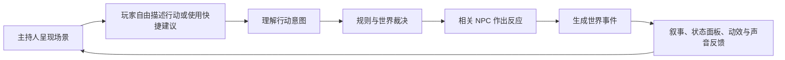
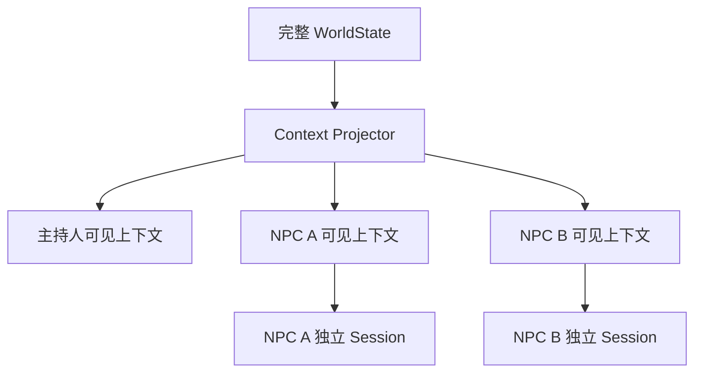
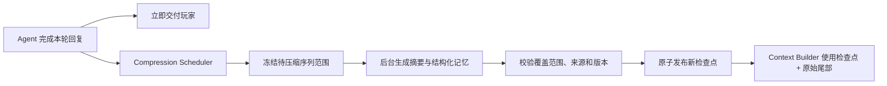
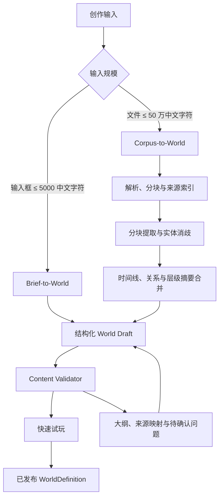
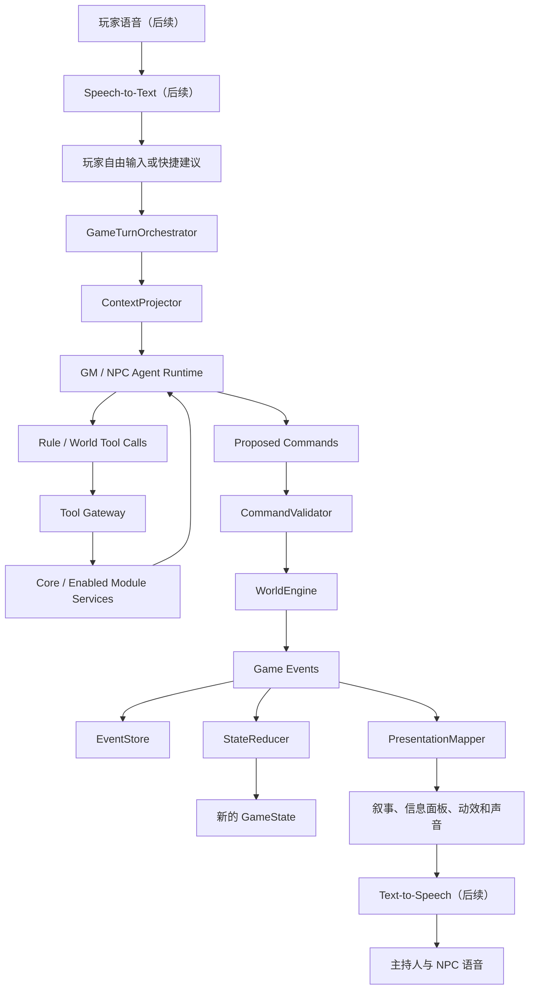

# Worldloom 项目设计文档

文档状态：Draft 0.7<br>
更新日期：2026-08-18

## 1. 产品定义

Worldloom（织境）是一款由 Agent 主持、由确定性规则引擎裁决的单人数字跑团 RPG。

玩家面对的不是一棵固定剧情树，而是一个拥有客观状态、角色认知、时间和因果关系的世界。玩家主要通过自然语言自由声明意图，也可以使用系统提供的情境化快捷建议；系统将意图转化为规则命令，结算后再由主持人 Agent 把玩家能够感知的结果组织成叙事。

产品核心由以下能力组合而成：

```text
可计算的世界
+ 有信息边界的 Agent 角色
+ 可验证的规则与事件
+ 自由的角色扮演与清晰的状态反馈
```

卡片、面板、时间线条目等属于表现层，用于展示玩家状态、世界实体、启用模块的投影和判定结果。自然语言输入是玩家表达行动的主要入口。

### 1.1 产品支柱

1. **自由行动**：玩家可以描述未被预设按钮覆盖的行动。
2. **世界可信**：门、物品、人物、时间和秘密都具有稳定状态。
3. **角色独立**：每个 NPC 都拥有自己的知识、记忆、目标和行动权限。
4. **失败推进**：失败产生代价与新局面，而不是让游戏停住。
5. **表现可读**：规则与状态变化通过叙事、信息面板、动效和声音明确反馈。
6. **内容可扩展**：同一引擎能够加载不同题材的 `.worldloom` 世界包。

### 1.2 首要平台

| 平台 | 优先级 | 首版目标 |
|---|---:|---|
| Windows Desktop | P0 | 快速迭代、世界工坊和完整试玩 |
| Android | P0 | 主要移动游戏平台 |
| iOS | P1 | 与 Android 共用核心逻辑和大部分 UI |
| macOS / Linux | P2 | 复用 Desktop 目标，完成打包验证 |

### 1.3 首个内置短篇世界

首个内置世界采用战争生存题材。玩家扮演一名 13 岁少年，在一场持续 300～1000 个世界日、结束时间未知的战争中设法活下去。

每个新存档使用可重放的随机种子，从闭区间 `[300, 1000]` 的整数中按均匀分布生成隐藏的战争结束日，区间内每个世界日成为战争结束日的概率相同。该值由世界包初始化为私有变量 `war.end_day`，Runtime 只负责执行可审计的随机初始化和保存类型化世界变量，不存在固定的 `WorldState.warEndDay` 字段。玩家不能直接看到结束日期，只能从前线变化、广播、物价、征兵、难民和阵营行动中判断战争进程。

```yaml
variables:
  - id: war.end_day
    type: integer
    visibility: private
    initializer:
      randomInteger:
        minInclusive: 300
        maxInclusive: 1000
```

游戏采用场景驱动的变速时间：危险行动按分钟或小时推进，日常生存按半天或一天推进，局势稳定时可以压缩数日并展示期间发生的事件摘要。玩家不需要逐日操作完整的 300～1000 天。

基础目标是活到停战；结局同时评价身体与心理状态、家人与同伴的命运、住所和归属、关键道德选择以及角色在战争中的成长。主要世界系统包括饥饿、疲劳、疾病、压力与创伤、天气和季节、补给、关系、阵营、前线、传闻和战争时钟。

首个世界随包携带 `war-survival-2d6/v1` 规则配置：体魄、灵巧、感知、心志和共情五项属性；求生、潜行、急救、修理、搜寻与交涉等技能；生命、饥饿、疲劳、压力、创伤与补给等资源或状态；检定采用 `2d6 + 属性 + 技能 + 情境修正`，10+ 为完整成功、7～9 为成功但付出代价、6- 为失败并产生新局面。这些都是首个世界的数据，不是 Runtime 固定枚举或字段。

## 2. 核心游戏循环



一次行动必须经历四个不同阶段：

1. **Intent**：玩家想做什么、想达成什么；
2. **Command**：系统把意图转化为受约束的行动请求；
3. **Event**：世界引擎确认实际发生的事实；
4. **Presentation**：表现层把事实变成玩家可见的叙事和动画。

语言模型不能跳过 Command 与 Event，直接宣称世界已经改变。

### 2.1 判定原则

只有在“结果不确定”且“失败有意义”时进行判定。

属性、技能、资源、状态、骰子表达式、修正来源和结果档位都由世界包中的定义与 `RuleProfile` 提供。Runtime 不预设属性数量和名称，也不预设角色一定拥有生命、饥饿、法力或其他特定资源。

所有已注册判定框架共享以下执行管线：

```text
声明意图
→ 按 CheckProfile 解析输入和修正来源
→ 冻结难度、风险、公式与随机请求
→ 执行可审计随机或确定性计算
→ 确定结果档位
→ 由对应领域规则生成代价、效果和 GameEvent
```

`CheckProfile` 可以声明骰子公式、修正槽位、对抗方式、重掷规则和结果区间。常见算法由声明式配置表达；复杂算法由带版本的规则模块实现，并由世界包选择启用。

统一管线不表示每个世界都拥有战斗、调查和社交，也不表示这些领域具有相同玩法。世界包可以选择和配置对应模块，例如：

- 战斗模块可以启用行动顺序、距离区间、掩体、伤害层级、状态与撤退规则；
- 调查模块可以把结果映射为线索完整度、耗时和风险，并配置关键线索的失败推进方式；
- 社交模块可以选择信任、恐惧、债务、声望等关系维度，并依据 NPC 的目标、知识与筹码解释结果。

Worldloom Runtime 提供类型系统、普通检定、对抗检定、资源映射、状态机、随机审计和模块注册等题材无关能力；行动顺序、距离、背包、任务、线索、时钟、关系等作为可选规则模块提供。织境 Agent 根据剧本生成 `CharacterCreationProfile` 与 `RuleProfile`，Content Validator 验证其组合、引用和数值边界；引擎不为某一种题材硬编码属性、资源、初始修正或领域参数。

世界包可以通过 `RuleProfile` 选择 Runtime 已注册的其他判定框架。织境 Agent 负责选择和配置规则，不生成或执行任意代码形式的新算法。

主持人 Agent 在需要判定时调用受约束的规则工具。`rule.resolve_check` 先冻结 CheckProfile 与参数，再通过 RandomService 执行配置要求的随机请求或确定性计算，随后由 RuleEngine 计算结果档位；启用骰子能力的世界还可以使用 `dice.roll`。资源和状态变化由 Agent 或 Behavior Runtime 提交 Command，经验证后由 WorldEngine 通过 Event 应用。

### 2.2 推进动力

- 玩家目标；
- 世界定义的事实、线索或其他信息结构；
- 已启用规则模块提供的时钟、计划或进度结构；
- NPC 目标与计划；
- 世界定义的时间、资源、物品与关系维度；
- 不可逆或代价高昂的选择。

## 3. 完整特性清单

### 3.1 自然语言剧本与世界生成

- 用户可以用一句话、分步对话或详细需求生成完整的可玩剧本；
- 首个创作入口提供文本输入框，单次输入不超过 5000 个中文字符；
- 首批文件导入支持 TXT 与 EPUB，单份资料提取和规范化后的正文最多 50 万个中文字符；
- 从复杂文本中提取实体、关系、事实、时间线、结局、规则钩子，以及所选模块需要的场景、线索、任务、时钟等结构；
- 将提取结果组织为可验证的 `WorldDefinition` 和 `.worldloom` 世界包；
- 通过自然语言继续扩写、删改、重排或重生成选定内容；
- 在生成过程中向用户展示结构化大纲、实体关系和待确认的剧情歧义；
- 保留生成内容与来源片段之间的映射，便于核对和定向修改；
- 自动检查引用完整性、角色知识边界、事件时序、模块约束和基础可玩性；
- 生成后可以立即进入快速试玩，并把试玩反馈带回创作对话继续迭代。

### 3.2 世界书库

- 浏览内置与导入世界；
- 世界封面、题材、规则、预计时长和内容提示；
- 多存档、多周目、已发现结局；
- 世界版本兼容与存档迁移；
- 导入和导出 `.worldloom` 包。

### 3.3 角色创建

- 身份、背景，以及世界定义的属性、技能、资源、状态、特质与初始内容；
- 世界通过 `CharacterCreationProfile` 定义属性和技能的初始值、预算、上下限、成长规则与角色限制；
- 支持固定角色、角色模板、点数分配和根据玩家背景叙述生成四种创建方式；
- 织境 Agent 根据剧本生成角色创建配置和草稿，规则层验证最终数据。

### 3.4 主游戏

- 场景与叙事时间线；
- 以自然语言输入为主，提供与当前场景相关的情境化快捷建议；
- 通过世界包启用的交流、调查、移动、遭遇、交易、物品和其他行动模块与世界交互；
- 根据 `presentation.json` 和启用模块展示角色、世界、关系、资源、信息与进度面板；
- 自动存档、事件回顾和分支存档；
- 模型响应期间保持界面、环境和取消操作可用。

### 3.5 语音游玩（后续特性）

- 可配置云端或本地语音转写（STT）Provider、模型、语言与识别参数；
- 支持按住说话、点击开始/结束和连续对话模式；
- 流式展示部分转写结果，并允许玩家在提交行动前查看和修改文本；
- 转写后的玩家话语进入与键盘输入相同的意图理解、规则判定和世界事件流程；
- 可配置云端或本地语音合成（TTS）Provider、模型和合成参数；
- 叙事文本与合成语音同步流式输出，支持暂停、跳过、重播和中途打断；
- 支持纯文本、语音输入配文字输出、文字输入配语音输出和全语音等组合；
- 保存转写文本、发言角色和时间点，支持字幕、回顾与无障碍使用。

### 3.6 世界工坊

- 创建场景、角色、实体，以及启用模块提供的物品、线索、任务、时钟和其他内容类型；
- 编辑世界规则和信息展示模板；
- 通过自然语言和导入资料生成或修改内容；
- 引用、权限、知识泄露和不可达路线检查；
- Fake Agent 模拟与快速试玩；
- 打包、升级和导出世界。

### 3.7 回放与开发者模式

- 查看每回合工具调用与规则判定；
- 查看世界引擎接受或拒绝的命令；
- 普通玩家回放展示公开 Agent 行为，作者调试模式可以检查完整角色因果链；
- 从检查点重放或创建分支；
- 世界作者可开启完整因果链调试。

## 4. 信息呈现与动效设计

主游戏界面的视觉中心始终是当前场景、主持人叙事与玩家行动输入。角色和世界信息位于侧栏、浮层或可展开的信息块中，帮助玩家理解局面；自然语言行动区始终与当前叙事保持直接关联。

卡片可以作为紧凑的信息容器。“卡片”描述组件形态，点击后可以查看、展开、定位或使用对应对象；相关操作最终进入统一的意图理解与规则判定流程。具体面板、字段、排序、组件类型和数据绑定由 `presentation.json` 与已启用模块提供，Runtime 只实现可复用组件和绑定解释器。

### 4.1 信息层级

| 展示区域或组件 | 用途 |
|---|---|
| 场景与叙事主区 | 当前地点、时间、可感知环境、主持人叙述与事件时间线 |
| 玩家行动区 | 自然语言输入、掷骰请求和少量情境化快捷建议 |
| 主体投影 | 世界定义的属性、资源、状态、特质、目标和公开信息 |
| 世界概览 | 世界定义的地点、时间体系、组织、关系和局势投影 |
| 实体信息 | 公开身份、关系、可观察状态和可执行操作 |
| 模块面板 | 背包、能力、线索、任务、时钟等已启用模块提供的界面 |
| 判定与结果 | 当前 CheckProfile 的输入、修正、随机记录、结果档位和状态变化 |

### 4.2 表现数据边界

Agent 只产生语义结果，不能产生任意 UI 代码：

```kotlin
data class PresentationCue(
    val semantic: CueSemanticId,
    val subjectId: String?,
    val intensity: Int,
    val mood: Mood,
    val visibility: Visibility,
)
```

以下是启用线索模块时的一种表现映射示例，不属于 Runtime 必备语义：

```text
CLUE_REVEALED
→ 线索信息块高亮并展开
→ 金色丝线连接相关节点
→ 播放揭示音效
→ 线索板写入新关系
```

### 4.3 视觉语言

默认方向：深色织物、低饱和场景、金色命运丝线、局部高亮的信息面板边界。

动效节奏遵循“平时克制、关键事件集中释放”：

- 常驻：呼吸、雾、烛火和低密度粒子；
- 操作：面板展开与收起、条目定位、已注册直接操作和时间线插入；
- 规则：随机记录、资源、状态、关系和进度反馈；
- 叙事：信息揭示、场景重新编织和结局转场。

必须提供减少动态效果、30 FPS、省电和跳过长动画选项。

## 5. Agent 设计

### 5.1 主持人 Agent

主持人是导演、叙述者和调度者。NPC 的私有思考由各自独立的 NpcAgent 负责。

职责：

- 理解玩家意图；
- 判断是否需要规则检查；
- 调用受约束的掷骰、检定和世界查询工具；
- 调度相关 NPC；
- 组织玩家可见结果；
- 控制场景节奏。

主持人通过调度 NPC 获得角色反应，并通过受验证的 Command 请求世界状态变化。

### 5.2 NPC Agent

所有 NPC 使用统一的 `NpcAgent` 模型：

```text
固定设定
+ 私有知识
+ 独立记忆与目标
+ 关系和运行时状态
+ 当前可见观察
+ 相关世界事件
→ 台词、表情、情绪、工具调用和行动意图
```

每个 NpcAgent 拥有稳定角色 ID、独立 Session、感知投影、私有记忆、目标、关系和工具权限。它可以回应玩家、与其他 NPC 交流，并使用当前世界启用模块提供的行动能力，也可以在时间或世界事件触发时推进自己的计划。多个 NPC 同时提出的行动由 WorldEngine 统一排序和结算。

### 5.3 NPC 运行策略

NpcAgent 的角色模型保持一致，Runtime 根据当前情境为每次唤醒选择运行策略：

| 维度 | 可配置内容 |
|---|---|
| 唤醒条件 | 玩家交互、进入感知范围、收到消息、时间推进、计划到期或相关世界事件 |
| 执行方式 | 单步反应、短工具循环或多步计划推进 |
| 自主程度 | 回应当前事件、提出即时行动或推进长期目标 |
| 记忆策略 | 最近原始交互、结构化情景记忆、信念、目标、关系和已发布的上下文检查点 |
| 工具范围 | 查询、交流、移动、物品、交易、战斗、组织与世界交互权限 |
| 预算 | 模型、上下文长度、工具步骤、并发、超时和费用上限 |

同一个 NpcAgent 可以随场景相关度、目标紧迫度和事件影响动态改变运行策略。休眠期间保留结构化状态、记忆和计划，收到触发事件后继续使用原有身份与上下文。

### 5.4 织境 Agent

织境 Agent 负责自然语言剧本与世界生成工作流：

- 理解用户的创作需求并生成完整世界草稿；
- 导入复杂剧情文本并提取结构化实体、关系、时间线与因果；
- 维护来源片段与生成内容之间的映射；
- 针对歧义、缺失关系和规则冲突向用户发起确认；
- 用自然语言创建、补全和修改场景、角色、线索、任务与规则；
- 根据剧本生成 `CharacterCreationProfile`、`RuleProfile` 和 Behavior AST；
- 运行内容验证并模拟可能路线；
- 发布带版本的 `WorldDefinition` 供游戏 Runtime 加载。

游戏 Runtime 以已发布的 `WorldDefinition` 为内容基线，运行中的事实变化由 WorldEngine 和 EventLog 维护。

### 5.5 Agent Tool

Agent 通过结构化 Tool 使用规则和世界能力。Tool 是 Agent Runtime 与权威执行组件之间的调用边界，每次调用都记录参数、调用者、权限范围、结果和关联回合。所有改变游戏状态的 Tool 都生成类型化 GameCommand，经 CommandValidator 和 WorldEngine 处理后产生 GameEvent。

以下名称描述 Runtime 与内置可选规则模块能够注册的语义能力面，不是每个世界都拥有的固定 Tool 列表。`manifest.json` 声明启用模块，模块注册 Tool、Command、Event、Schema 与投影；Tool Gateway 再根据 Agent 身份和权限暴露其中一部分。实现时可以把同一领域的多个操作合并为一个 Tool 和受 Schema 约束的 `operation` 字段，合并后仍分别产生明确的 Command 与 Event 类型。

#### 5.5.1 查询、规则与随机

| Tool | 能力 |
|---|---|
| `world.query` | 查询调用者能够感知的实体、组件、变量和已启用模块投影 |
| `history.query` | 查询调用者可见的 EventLog、叙事记录和历史判定 |
| `rules.lookup` | 查询当前世界已注册的定义、规则模块、能力、状态、行动成本和效果 |
| `memory.search` | 查询当前 Agent 的情景记忆、信念、目标、关系和已发布上下文检查点 |
| `memory.remember` | 将已感知事实写入当前 Agent 的记忆，并标记显著性与来源 |
| `dice.roll` | 执行独立掷骰、伤害骰或随机表掷骰，返回 Roll Record |
| `random_table.roll` | 按世界包中的权重表生成类型化随机结果 |
| `rule.validate_action` | 根据当前 RuleProfile 和模块 Schema 检查行动参数与合法性 |
| `rule.resolve_check` | 冻结检定参数，掷骰并结算普通、对抗或抵抗检定 |
| `rule.resolve_effect` | 根据已注册 EffectDefinition 结算资源、状态、关系或其他模块效果 |

正式检定通过 `rule.resolve_check` 完成：工具按 CheckProfile 冻结输入、公式、难度和修正来源，再按配置调用 RandomService 或确定性计算器，并返回关联 Random Record 与 Check ID 的完整 Check Record。所有随机结果作为独立记录进入 EventLog，使回放直接复用已经发生的随机事实。RuleEngine 在给定相同 WorldState、规则版本和随机记录时产生相同的判定结果。

#### 5.5.2 角色、资源与状态

玩家角色和 NPC 使用相同的 Character Entity 与资源工具。

| Tool | 能力 |
|---|---|
| `character.resource.adjust` | 按世界定义的 ResourceId 调整玩家或 NPC 资源，记录增减值、原因和来源事件 |
| `character.metric.adjust` | 按 AttributeId、SkillId 或其他 MetricDefinition 调整数值，并记录持续时间和修正来源 |
| `character.condition.apply` | 按 ConditionId 施加世界定义的状态 |
| `character.condition.update` | 更新状态层数、强度、剩余时间或触发次数 |
| `character.condition.remove` | 解除指定状态并记录解除原因 |
| `character.state_machine.transition` | 在世界定义的 StateMachineDefinition 中执行合法状态转移 |
| `character.progress.apply` | 按 ProgressionDefinition 应用能力、特质或其他成长效果 |
| `activity.resolve` | 按 ActivityDefinition 结算休息、训练、恢复或其他世界活动 |
| `ability.use` | 验证并结算当前世界注册的能力 |
| `group.membership.update` | 由群组模块更新成员、角色、顺序和共享资源关系 |

`character.resource.adjust` 同时覆盖玩家与 NPC 的任意已定义资源。战争世界可以用它处理 `war.health` 与 `war.hunger`；空间站 AI 世界可以用同一 Tool 处理 `station.energy` 与 `station.bandwidth`。Tool Schema 验证 ResourceId 是否由当前世界或启用模块声明。

Tool Gateway 按行动语义分配写权限：Agent 通常提交能力、活动或模块行动，由 RuleEngine 产生资源和状态变化；具备直接调整权限的主持人也必须引用已注册的 EffectDefinition 或剧情代价来源。这样所有 Agent 都使用工具行动，同时保留规则裁决和事件审计。

#### 5.5.3 物品、装备与经济模块

| Tool | 能力 |
|---|---|
| `inventory.add` | 将物品、数量和实例状态加入角色、容器或地点 |
| `inventory.remove` | 从指定持有者移除、消耗或销毁物品 |
| `inventory.transfer` | 在角色、容器和地点之间原子转移物品 |
| `item.use` | 验证使用条件并结算消耗、充能、冷却与效果 |
| `item.equip` | 装备物品并应用对应属性与能力变化 |
| `item.unequip` | 卸下物品并更新相关属性与能力 |
| `item.state.update` | 更新耐久、弹药、充能、品质、绑定和其他实例状态 |
| `trade.resolve` | 原子结算报价、货币、物品交换、折扣和关系影响 |
| `craft.resolve` | 验证配方与材料，执行制作、修理、拆解或炼制 |

#### 5.5.4 关系、知识与冒险进度模块

| Tool | 能力 |
|---|---|
| `relationship.adjust` | 更新角色之间的信任、好感、恐惧、债务、敌意和关系标签 |
| `faction.reputation.adjust` | 更新角色与阵营之间的声望、通缉度、地位和权限 |
| `faction.plan.update` | 更新组织目标、计划阶段、资源投入和公开或隐藏行动 |
| `knowledge.update` | 记录玩家、NPC 或群体得知、相信、怀疑或证伪的事实及其来源和可信度 |
| `clue.discover` | 创建玩家已知线索并关联来源、场景、人物和事件 |
| `clue.connect` | 建立线索之间的推理、矛盾、印证或因果关系 |
| `quest.create` | 创建任务、目标、参与者、奖励和失败条件 |
| `quest.update` | 更新任务阶段、目标进度和可见说明 |
| `quest.resolve` | 结算任务结果、奖励、代价和后续世界事件 |
| `clock.create` | 创建危险、计划、仪式、追兵或长期事件时钟 |
| `clock.advance` | 推进、回退或设置时钟，并触发达到刻度后的效果 |
| `clock.resolve` | 结算时钟完成、取消或转化后的世界结果 |

#### 5.5.5 场景、时间与世界模块

| Tool | 能力 |
|---|---|
| `scene.transition` | 将玩家或实体移动到新场景，结算进入、离开和途中事件 |
| `entity.move` | 更新角色、物品、载具或其他实体的位置与移动方式 |
| `entity.spawn` | 按世界定义创建角色、物品、障碍、区域或临时实体实例 |
| `entity.state.update` | 更新门锁、机关、载具、建筑、天气等实体或环境状态 |
| `entity.despawn` | 结算实体离场、隐藏、消散或永久移除 |
| `world.fact.record` | 写入已经成立的世界事实及其来源、时间和可见性 |
| `world.fact.update` | 更新事实的有效期、状态、替代关系和变更原因 |
| `location.discover` | 标记地点已发现并更新地图、路线和旅行选项 |
| `travel.resolve` | 按 TravelProfile 结算路线、耗时、资源、环境、随机事件和抵达状态 |
| `time.advance` | 按世界 TimeProfile 推进连续时间、离散 Tick 或其他时间单位，并触发相关事件 |
| `event.schedule` | 安排指定时间、条件或观察事件触发的世界事件 |
| `event.update` | 修改计划事件的触发条件、优先级或载荷 |
| `event.cancel` | 取消尚未发生的计划事件并记录原因 |
| `environment.update` | 更新天气、光照、声音、危险等级和场景环境标签 |

#### 5.5.6 对话、行动与遭遇模块

| Tool | 能力 |
|---|---|
| `communication.send` | 产生公开对话、耳语、喊话、信件、广播或远程消息事件 |
| `action.propose` | 提交尚未匹配专用模块的自由形式结构化行动意图，由规则和世界引擎验证 |
| `player.prompt` | 请求玩家补充描述、确认对象、作出选择或提供角色决定 |
| `encounter.start` | 创建战斗、追逐、辩论或其他有顺序的遭遇上下文 |
| `initiative.resolve` | 依据规则确定或更新参与者行动顺序 |
| `combat.action.resolve` | 结算攻击、防御、施法、能力、援助、擒抱、撤退等战斗行动及其连锁效果 |
| `turn.advance` | 推进当前行动者、轮次、持续效果与回合触发器 |
| `encounter.end` | 结算遭遇结束状态、战利品、伤亡、逃离和后续事件 |
| `presentation.cue` | 请求语义化的动画、音效、镜头、高亮或语音情绪提示 |

#### 5.5.7 创作 Agent Tool

| Tool | 能力 |
|---|---|
| `source.ingest` | 导入、解析、分段并索引自然语言需求、TXT 与 EPUB 剧情资料 |
| `draft.generate` | 从需求与来源生成结构化世界草稿 |
| `draft.patch` | 按自然语言指令定向修改选定草稿内容 |
| `draft.entity.upsert` | 创建或更新场景、NPC、物品、线索、任务、时钟和规则实体 |
| `draft.relationship.upsert` | 创建或更新实体关系、知识边界、时序和因果连接 |
| `draft.profile.upsert` | 创建或更新 CharacterCreationProfile、RuleProfile 和 Behavior AST |
| `draft.validate` | 执行 Schema、引用、时序、知识隔离、可达性和规则检查 |
| `draft.simulate` | 使用 Fake Agent 运行路线模拟和快速试玩 |
| `draft.publish` | 生成带版本的 WorldDefinition 与 `.worldloom` 世界包 |

Tool Gateway 先根据 `manifest.json` 启用的模块构建 Tool Registry，再根据调用者身份、当前上下文、感知范围、实体所有权、规则集和世界包权限生成可用 Tool 集合，并负责参数 Schema、调用权限、回合关联、超时、预算和循环限制。未启用模块的 Tool、Command、Event 与 UI 投影不会注册。NpcAgent 使用与自身身份和权限相符的工具；主持人 Agent 使用已启用的编排和规则工具；织境 Agent 使用草稿命名空间下的创作工具。

### 5.6 感知与信息隔离



每个 NPC Session 保存自己的私有知识与记忆。主持人接收公开台词、表情、动作和已经发生的世界结果，并据此组织玩家可见叙事。

### 5.7 Agent Loop 与模型适配

Agent Loop 由 Worldloom Runtime 实现，不委托给模型供应商 SDK。首批文本模型协议为：

| Adapter | 协议边界 |
|---|---|
| `OpenAIChatCompletionsAdapter` | 以 OpenAI Chat Completions `/v1/chat/completions` 为兼容边界，包括消息、流式增量、`tools`、`tool_calls`、工具结果、结束原因和用量 |
| `AnthropicMessagesAdapter` | Anthropic Messages `/v1/messages`，包括顶层 system、content blocks、`tool_use`、`tool_result`、流式事件、结束原因和用量 |

Runtime 使用与供应商无关的 `ModelRequest`、`ModelMessage`、`ModelToolDefinition`、`ModelStreamEvent`、`ModelToolCall` 和 `ModelUsage`。Adapter 负责协议转换，并声明 streaming、tool calling、parallel tools、strict schema、structured output 和 prompt cache 等能力，Runtime 不假设不同供应商拥有完全相同的功能。

一个 `AgentTurn` 定义为“Agent 收到一次触发，经过零到多次模型与工具循环，直到产生本轮最终发言或行动”。触发可以来自玩家输入、世界事件、计划到期或其他 Agent 的消息；中间的 Tool Call 不单独计为一个 AgentTurn。

```text
组装角色上下文
→ 调用模型 Adapter
→ 收集并规范化 Tool Call
→ Tool Gateway 校验和执行
→ 将 Tool Result 写回当前循环
→ 重复直到得到最终回复或达到步骤、时间、费用上限
```

### 5.8 Agent 记忆与异步上下文压缩

Agent 记忆不是客观世界事实的替代品。`WorldState + EventLog` 保存真实发生的事实；Agent 只保存自己感知到的情景、信念、目标和关系，因此可以不知道真相、产生误解或遗忘细节。

记忆分为：

| 层次 | 内容 |
|---|---|
| 工作记忆 | 最近若干轮原始交互、当前观察和本轮 Tool 结果 |
| 情景记忆 | 谁在何时何地经历了什么，以及情绪、显著性、可信度和来源事件 |
| 信念记忆 | Agent 当前认为成立、怀疑或已证伪的事实 |
| 目标与关系 | 当前计划、承诺、信任、恐惧、敌意、债务和其他长期状态 |
| 上下文检查点 | 对已经覆盖的一段交互和事件生成的结构化摘要 |

上下文压缩采用主动、增量、异步策略。Runtime 在每个 AgentTurn 完成后评估压力并调度后台任务，前台结果立即交付，玩家不等待摘要生成。通用触发条件来自上下文使用量、尚未压缩的 AgentTurn 数量、`context.checkpoint_requested` 生命周期事件、Agent 空闲状态和预计即将再次唤醒；场景、任务或会话模块都可以发出检查点请求，Memory Runtime 不直接依赖这些模块，也不使用世界内经过多少天作为通用压缩条件。

首版采用以下初始参数：

- 上下文达到可用预算的 50% 时进入软水位线并开始后台压缩；
- 尚未压缩的历史达到 12 个 AgentTurn 时主动压缩；
- 收到 `context.checkpoint_requested` 且至少积累 4 个 AgentTurn 或 2000 Token 时主动压缩；
- 上下文达到可用预算的 75% 时进入硬水位线保护；
- 压缩后目标占用为可用预算的 30%～35%，始终保留最近 6～8 个完整 AgentTurn 原文；
- 重大事实、承诺、目标或关系变化在发生时直接写入结构化长期记忆，不等待滚动压缩。

压缩任务只处理启动时冻结的追加式序列范围。假设任务覆盖 Event 1000～1250，生成期间产生 Event 1251～1278，发布后的上下文由摘要 1000～1250 与原始尾部 1251～1278 组合。玩家在任务完成前发起下一轮时，Runtime 使用上一个有效检查点和当前原始尾部，不等待正在运行的任务。



压缩任务使用独立配置的 `CompactionModel`，默认选择同一 Provider 中速度较快、成本较低且支持结构化输出的模型，以温度 0 按固定 Schema 生成 `checkpointSummary`、`episodicMemories`、`beliefUpdates`、`goalUpdates`、`relationshipUpdates`、`coveredSequence` 和 `sourceEventIds`，不授予游戏 Tool。客观数值和世界事实直接从 EventLog、Reducer 与结构化 Tool Result 提取，压缩模型只整理叙事和角色主观记忆。

每个 Agent 同时只运行一个压缩任务；重叠请求合并，任务使用 `agentId + fromSequence + toSequence + promptVersion` 作为幂等键。移动端全局最多运行一个后台压缩任务，桌面端最多运行两个。生成中的检查点不可见，校验成功后原子发布；失败时继续使用上一个有效检查点，不影响游戏进行。前台回合请求始终拥有更高的并发、连接和限流优先级，后台压缩队列在资源紧张时暂停或让出执行槽。

Context Builder 始终加入角色设定、当前感知、目标、关系、最近原始 AgentTurn 和最新有效检查点，再按人物、地点、标签、当前目标、显著性与最近访问时间召回 8～12 条长期记忆。硬水位线下依次裁剪已反映到状态中的冗长 Tool 输出、减少低显著性召回、使用最近有效检查点和原始尾部，最后才执行最小范围的同步应急压缩。

## 6. 核心架构

### 6.1 内容生成管线



`Brief-to-World` 面向首个版本的文本输入框，依次完成大纲和实体提取、世界草稿生成、内容验证与快速模拟。它仍然是分阶段任务，不把一段提示直接一次生成成最终世界包。

`Corpus-to-World` 面向 TXT 与 EPUB 文件，是可恢复、可取消并展示进度的异步工程任务。TXT Ingestor 识别 UTF-8、UTF-8 BOM、UTF-16 与 GB18030，规范化换行、空白和控制字符，并从标题、空行与段落结构推断章节。EPUB Ingestor 按 manifest、spine 和目录恢复阅读顺序，提取书名、作者、章节标题与 XHTML 正文，并为来源片段保留 `epubHref` 和段落路径。

两种格式统一转换为 `SourceDocument → SourceSection → SourceChunk`，以规范化后的 Unicode 正文计算 50 万字符限制。管线随后执行章节和场景分块、实体与事件提取、别名和同一实体归并、关系与时间线合并、矛盾和歧义审查、层级摘要、来源映射、世界生成和模拟验证。每个生成实体都保留 `sourceChunkIds`，使用户能够追溯来源并定向修订。手机端按块存储和展示进度，不把 50 万字一次性加载到 UI 或单次模型上下文。

### 6.2 游戏运行管线



### 6.3 权威边界

| 组件 | 拥有的权威 |
|---|---|
| Source Ingestor | 输入文本分段、来源索引和素材元数据 |
| Creation Agent | 提出世界草稿和内容修改 |
| Content Validator | Definition、模块依赖、内容 Schema、引用、时序、知识边界与可玩性验证结果 |
| Module Registry | 按 manifest 加载带版本模块，并注册其 Tool、Command、Event、Reducer、投影和 UI 能力 |
| WorldEngine | 客观世界事实 |
| RandomService | 使用受控随机源执行整数、骰子和随机表请求，并创建可审计的 Random Record |
| RuleEngine | 根据状态、规则与随机记录计算修正、结果档位和合法性 |
| Tool Gateway | Agent Tool 的 Schema、权限、回合关联和调用记录 |
| Behavior Runtime | 执行经过验证的 Behavior AST，并以系统身份提交 GameCommand |
| Agent Runtime | 判断何时调用工具、提出意图与 Command、生成语言 |
| ContextProjector | 角色能够感知和回忆的信息 |
| ContextCompactor | 对冻结的历史范围生成候选摘要和结构化记忆；不能修改 WorldState 或覆盖 EventLog |
| Speech Runtime（后续） | 语音流、转写文本、合成队列和角色音色映射 |
| PresentationMapper | 按 PresentationDefinition 将 DefinitionId、模块投影和事件映射为 UI 与视听提示 |
| EventStore | 已发生事实的持久记录 |

### 6.4 事件溯源

所有事实变化统一走：

```text
GameCommand
→ 验证
→ GameEvent
→ Reducer
→ GameState
```

EventLog 是真相历史，GameState 是 EventLog 的当前投影。定期保存快照以避免每次从头回放。

这为以下能力提供基础：

- 自动存档；
- 回放；
- 分支剧情；
- 崩溃恢复；
- Agent 行为审计；
- 世界包版本迁移。

### 6.5 程序代码与世界配置边界

系统按四层组织能力：

| 层次 | 责任 | 示例 |
|---|---|---|
| 引擎基础设施 | 与题材无关且必须保持确定性的能力 | 类型系统、Command/Event 信封、验证、事件溯源、随机审计、Agent Loop、DSL 解释器、持久化 |
| 可选规则模块 | 可复用的算法、Schema、Tool、Command、Event 与投影 | 背包、交易、关系、线索、任务、时钟、行动顺序、距离和日历 |
| 世界包规则配置 | 选择模块并定义名称、数值、公式、状态机和表现绑定 | AttributeDefinition、ResourceDefinition、CheckProfile、RuleProfile、PresentationDefinition |
| 具体剧本内容 | 某个世界独有的人物、地点、目标、事件和结局 | 13 岁少年、战争、饥饿、前线、停战和 `war.end_day` |

运行时状态按命名空间 DefinitionId 和类型化组件保存，不为世界内容建立固定枚举或字段：

```kotlin
@JvmInline
value class DefinitionId(val value: String)

sealed interface TypedValue

data class EntityState(
    val entityId: String,
    val components: Map<DefinitionId, ComponentInstance>,
)

data class ComponentInstance(
    val fields: Map<DefinitionId, TypedValue>,
)

data class WorldState(
    val entities: Map<String, EntityState>,
    val variables: Map<DefinitionId, TypedValue>,
    val moduleStates: Map<DefinitionId, ModuleState>,
)
```

注册模块可以使用类型安全的 Kotlin Command、Event 和 Reducer 实现原子交易、路径计算或其他复杂算法；世界包只选择模块并提供定义和参数。配置驱动不意味着把所有逻辑降级为无类型 JSON，也不允许世界包执行任意代码。

工程实现遵循以下约束：

- 不建立固定的 Attribute、Skill、Resource、Condition 或 LifeState 内容枚举；
- 不在 PlayerState、CharacterState 或 WorldState 中添加 `health`、`hunger`、`warEndDay` 等题材字段；
- UI 不直接读取特定 ResourceId，而是解释 PresentationDefinition 的字段绑定；
- Runtime 不在启动时注册所有领域 Tool，只加载 manifest 启用模块的能力；
- 世界包不因 Runtime 内置了某个模块就必须提供该模块的数据文件。

## 7. 跨端技术架构

目标技术栈：

```text
Kotlin Multiplatform
Compose Multiplatform
Coroutines / Flow
kotlinx.serialization
Ktor Client
SQLDelight
```

目标模块结构：

```text
apps/
├── androidApp
├── iosApp
└── desktopApp

shared/
├── ui-design-system
├── ui-game
├── ui-workshop
├── application
├── definition-runtime
├── domain-world
├── domain-rules
├── rule-module-api
├── rule-module-registry
├── rule-modules
├── agent-runtime
├── content-schema
├── content-generation
├── voice-runtime
├── persistence
└── provider-api

platform/
├── secure-vault
├── file-import-export
├── speech-audio
├── audio-haptics
└── lifecycle-windowing
```

`definition-runtime` 负责 DefinitionId、TypedValue、动态组件和配置解析；`rule-module-api` 与 Registry 负责模块生命周期和能力注册；`rule-modules` 保存可选且与具体世界无关的模块实现。`war-survival` 与其他世界内容只存在于世界包或测试夹具中，不进入共享 Runtime 模块。

共享代码通过接口或 `expect/actual` 使用平台能力；Android Context、JVM 文件 API、Apple Framework、麦克风、音频焦点和后台播放实现位于对应平台模块。

### 7.1 当前仓库状态

当前仓库已完成十六轮工程基线，包含 KMP/Compose 工程骨架、Definition 与 TypedValue、Command/Event、Reducer、回放、application session、共享 UI，以及 Android、iOS 和 Desktop 平台入口。

已实现的共享能力包括 manifest 驱动的 `rule-module-api`/Registry、确定性与可审计随机判定、SQLDelight EventLog/快照/迁移、供应商无关的 Provider API、受预算和权限约束的 Agent Runtime、Tool Gateway，以及 OpenAI Chat Completions 流式适配器。Provider 设置中心支持非秘密 Base URL、Model ID、连接测试、模型发现和运行时切换；配置只保存 Vault 引用。Agent 会话、Turn、结构化记忆和压缩检查点已进入持久化边界，NPC 通过稳定角色 ID、私有上下文与权限按事件调度。`war-survival` 与 `station-ai` 通过同一 Runtime 完成模块加载、Tool 注册、状态更新、持久化、回放和 UI 投影，并通过同一个 `playable-world/v1` 加载器验证角色入口、场景、失败推进、结局和黄金路线，不在生产 Runtime 中引入题材分支。

平台凭据边界已落地 Android Keystore、iOS Keychain 与 Windows 用户级 DPAPI；非 Windows 的 Desktop 目前使用仅会话内存回退。共享 Runtime 已支持安全路径、CRC、大小限制和重复项检查的 `.worldloom` v1 STORED ZIP 容器、版本化 Behavior AST/Command 白名单、四种角色创建模式、RuleProfile，以及 Brief/TXT/EPUB 到可加载世界包的分阶段生成。Desktop 与 Android 的 EPUB 平台读取支持压缩条目和 GB18030；iOS 公共生成逻辑已编译，平台文件选择与压缩 EPUB/GB18030 桥接仍待接入。包签名、Anthropic Adapter、持久化生成任务实现和语音仍属于后续增量。

工程初始化的范围见[项目初始化设计](PROJECT_INITIALIZATION.md)，十六轮实现与验收证据见[迭代执行记录](ITERATION_EXECUTION.md)。

从第十六轮开始，产品验收顺序调整为“先证明人工编写的内置世界可从开局玩到结局，再扩展识别和自动生成”。`playable-world/v1` 是后续生成器必须满足的可玩性目标，而不是由生成流程反向决定 Runtime 结构。

## 8. 世界包格式

`.worldloom` 是带版本号的 ZIP 容器，建议包含：

```text
manifest.json
definitions/
├── attributes.json
├── skills.json
├── resources.json
├── conditions.json
├── state-machines.json
├── checks.json
├── character-creation.json
└── rules.json
content/
├── entities.json
├── relationships.json
└── scenes.json
modules/
presentation/
└── presentation.json
generation.json
sources/
behaviors/
assets/
locales/
```

`manifest.json` 至少记录：

- 格式版本；
- 世界 ID 与内容版本；
- 标题、作者和语言；
- 起始上下文或入口；
- Definition 索引与使用的 RuleProfile；
- 启用规则模块的 ID、版本、依赖和数据路径；
- 内容生成方式与来源索引；
- 资产索引与哈希；
- 兼容的最低 Runtime 版本。

声明可完整游玩的包还必须通过 `playableContractPath` 指向 `worldloom.playable-world/v1` 契约。旧夹具或尚未完成的内容包可以不声明该字段，并继续按原有格式加载，但不得标记为可玩世界。

`generation.json` 记录创作会话、来源片段映射、结构化提取结果和修订历史。`sources/` 保存用户选择随世界包归档的原始文本或资料，使后续定向再生成、来源核对和协作编辑具有稳定上下文。

上述目录是逻辑布局示例。`definitions/` 下只需要提供当前世界实际使用的定义类型，文件可以拆分或合并，并由 manifest 索引；没有属性、技能、场景或某类组件的世界不需要提供相应文件。

`definitions/character-creation.json` 保存 `CharacterCreationProfile`，包括创建模式、属性和技能初值、预算、上下限、模板、背景约束与成长规则。`definitions/rules.json` 保存 `RuleProfile`，选择 CheckProfile 和可选规则模块。两者都由织境 Agent 根据剧本生成，并在世界发布前完成 Schema、引用、权限和数值边界验证。

`modules/` 只包含 manifest 明确启用模块的数据。例如启用线索模块时可以提供 `modules/clues.json`，未启用该模块的世界既不需要对应文件，也不会注册相关 Tool、Command、Event、投影和 UI。`presentation/presentation.json` 通过 DefinitionId 绑定字段和模块投影。

世界包不能携带任意可执行代码。行为只能由受版本控制的 Behavior AST、类型化表达式和已注册的 GameCommand 权限表达。

### 8.1 可玩世界契约

`playable-world/v1` 描述角色入口、初始场景、所需模块、场景和行动图、玩家可见目标、显式失败推进、结局、表现绑定、Behavior 引用和确定性黄金路线。加载器在创建 Run 前完成以下检查：

- CharacterCreationProfile 或预建玩家入口恰好存在一个，并能解析到当前世界 Definition；
- 所需模块已经由 manifest 启用且版本兼容；
- Scene、Action、CheckProfile、Objective、Ending、Presentation 和 Behavior 引用闭合；
- 每个玩家行动包含显式失败后续，不允许无事件、无提示的停滞；
- 从初始场景至少能到达声明的每个结局，所有可达场景都存在后续行动；
- 随机黄金路线保存具体骰值，验证和回放不重新抽取随机事实。

黄金路线执行器本身没有状态写权限。application adapter 必须为每步返回 Tool、Command、已提交 Event 和递增序号的审计回执，并证明 replay 重建同一结局。完整字段、示例和作者检查表见[世界包创作指南](WORLD_PACKAGE_AUTHORING.md)。

### 8.2 行为描述 DSL

世界包采用“事件—条件—效果”的声明式 DSL。YAML 是作者可读和 Agent 生成格式，带类型的 JSON AST 是世界包中的规范存储格式；世界工坊和可视化行为图也编译到同一种 AST。下面的饥饿行为仅是首个战争世界的配置示例，不属于 Runtime 内置行为：

```yaml
schema: worldloom.behavior/v1
id: war.hunger.daily_damage

trigger:
  event: calendar.day_started
  bind:
    character:
      path: $event.subject

condition:
  all:
    - lte:
        - resourceValue:
            entity:
              ref: $character
            resource: war.food
        - value: 0
    - not:
        hasCondition:
          entity:
            ref: $character
          condition: war.fed

effects:
  - command: character.condition.apply
    args:
      entity:
        ref: $character
      condition: war.starving
      sourceEvent:
        path: $event.id

  - command: character.resource.adjust
    args:
      entity:
        ref: $character
      resource: war.health
      delta: -1
      reason: starvation

policy:
  priority: 100
  maxFiringsPerEvent: 1
```

顶层字段包括 `schema`、`id`、`trigger`、`condition`、`effects`、`policy` 和 `visibility`。表达式采用类型化 AST，首版提供：

- 逻辑：`all`、`any`、`not`；
- 比较：`eq`、`neq`、`lt`、`lte`、`gt`、`gte`；
- 数值：`add`、`subtract`、`multiply`、`divide`、`min`、`max`；
- 集合：`contains`、`anyMatch`、`count`；
- 世界查询：`resourceValue`、`metricValue`、`hasTag`、`hasCondition`、`relationshipValue`；
- 数据节点：`path`、`value`、`ref`。

DSL 不提供循环、递归、I/O、系统时间和可变全局状态。随机性通过显式的 `ResolveCheckCommand`、`RandomIntegerCommand` 或 `RollRandomTableCommand` 进入 RandomService 并写入 EventLog，不能作为普通表达式函数隐藏执行。

DSL 的编译流程为：

```text
YAML / 可视化行为图
→ Parser
→ Typed Behavior AST
→ Schema、类型、引用和 Command 权限检查
→ 规范化 JSON
→ Behavior Runtime
```

Tool Gateway 是 Agent 与权威系统之间的边界，Behavior Runtime 不模拟 Agent Tool Call。两类入口最终汇合到相同的 Command、Event 管线：

```text
Agent → Tool Gateway ┐
                     ├→ GameCommand → CommandValidator → WorldEngine → GameEvent
Behavior Runtime ────┘
```

任务、NPC 计划和战争阶段使用状态机或行为图描述节点、转移、守卫条件和效果，并编译为同一种 Behavior AST。高级作者扩展可以在后续增加受沙箱约束的脚本层，并继续通过相同的 Command 和 Event 边界与世界交互。

## 9. 模型供应商与安全

系统采用 BYOK。Provider Configuration Center 保存供应商中立的 Base URL、Model ID、输出限制、计费参数与 Vault 凭据引用，支持运行时选择、连接测试和模型发现；非秘密设置由 SQLDelight 持久化。当前 UI 提供 OpenAI 兼容配置的保存、切换、测试和模型发现，动态 Provider 路由在每次请求前读取选中配置。

当前已实现 OpenAI Chat Completions 兼容协议，包括 SSE 文本增量、分片 `tool_calls`、工具结果和最终用量；Anthropic Messages 仍是下一 Adapter。Agent Loop、工具调度、预算、上下文构建和会话隔离属于 Worldloom Runtime，不依赖供应商提供的 Agent 框架。适配实现依据 [OpenAI Function Calling](https://developers.openai.com/api/docs/guides/function-calling) 与 [Chat Completions API Reference](https://developers.openai.com/api/reference/resources/chat/subresources/completions/methods/create)，并始终在 Tool Gateway 本地重新校验模型参数。

语音属于后续特性。`provider-api` 保留 `SpeechToTextProvider` 与 `TextToSpeechProvider` 扩展边界，具体服务、模型、音色和交互在文本游戏闭环稳定后确定。

API Key 必须保存到平台凭据保险箱。目标与当前基线如下：

- Android：Keystore 非导出 AES-GCM 密钥与应用私有密文，已实现；
- iOS：Keychain generic password，已实现并完成 Kotlin/Native 编译；
- Windows：用户级 DPAPI 保护的原子写入密文，已实现；
- macOS：Keychain，待实现；
- Linux：Secret Service，待实现。

密钥不得进入：

- Agent 上下文；
- 世界包；
- 存档；
- EventLog；
- 崩溃报告；
- HTTP 正文日志；
- Git 仓库。

Agent Runtime 必须有最大步骤数、工具权限、超时、费用预算、参数 Schema 校验和循环检测。

当前 UI 只保存、删除并显示密钥的“已配置/未配置”状态，不读取或回显已保存密钥。非秘密 Provider 配置与密钥引用单独持久化。Provider 每次请求在凭据边界内短暂访问密钥，只把它放入 Authorization Header；HTTP 错误不会包含上游响应正文。

## 10. 性能预算

正式支持的最低体验基线为：

| 平台 | 系统与设备基线 | 内存预算 | 帧率目标 |
|---|---|---:|---:|
| Android | Android 10 或更高、ARM64、4 GB RAM | 应用常驻 300～400 MB | 稳定 30 FPS |
| iOS | iOS 17 或更高、iPhone SE 第二代或 iPhone 11 同级及以上、ARM64 | 应用常驻不超过约 300 MB | 稳定 30 FPS |
| Windows | 仍在微软支持周期内的 Windows 11、x86-64 或 ARM64、双核 1.5 GHz、8 GB RAM、集成显卡 | 应用常驻不超过约 600 MB | 1280×720 下稳定 30 FPS |

Windows 安装需要至少 2 GB 可用空间。Windows 10 已结束常规支持，只作为尽力兼容目标，不作为正式最低系统；Windows 端发布时测试微软仍在支持周期内的版本。性能充足的设备提供 60 FPS 模式。

最低配置使用网络 Provider 完成 LLM 推理，本地模型作为更高性能设备的可选能力。当前界面和后台任务性能测试不依赖语音功能；后续接入 STT/TTS 时单独建立音频延迟与内存预算。

移动端最高信息密度游戏场景建议上限：

```text
活跃信息浮层         ≤ 10
持续粒子             80–120
场景视差层           3–5
同时呼吸的角色       ≤ 3
实时模糊层           0–1
常驻全屏动画         ≤ 2
```

实现原则：

- 位移、缩放、旋转与透明度优先使用图层动画；
- `remember` 和 `drawWithCache` 缓存昂贵计算；
- 避免每帧创建 Path、Brush 和集合；
- 不可见信息组件和离场场景停止动画；
- 图片按设备尺寸预解码和预加载；
- 时间线、EventLog、NPC 和物品列表使用分页与虚拟化，不随存档长度一次性载入 UI；
- Agent、网络、存档、长文本生成和上下文压缩不运行在 UI 线程；
- 50 万字资料导入作为可恢复的后台任务处理，移动端只按需读取文本块、进度和审查结果；
- Release 构建使用基准配置并在真机测试。

若核心玩法演化为实时地图、复杂骨骼、动态光照或大量物理单位，应重新评估 Godot，而不是强行在 Compose 中实现。

## 11. 存档模型

一个运行存档至少包括：

```text
RunMetadata
WorldDefinitionReference
PlayerEntityReference
WorldStateSnapshot
EnabledModuleVersions
EventLog
AgentSessions
AgentMemories
AgentBeliefs
AgentGoals
RelationshipStates
ContextCheckpoints
PresentationCheckpoint
```

公开游戏回放与 Agent 私有记忆必须分区存储。普通玩家导出存档时，默认不包含未揭示秘密和 NPC 私有推理内容。

SQLDelight 持久化至少提供：

| 表 | 用途 |
|---|---|
| `agent_memory` | 结构化情景记忆及其显著性、可信度和来源 |
| `agent_belief` | Agent 相信、怀疑或已证伪的事实 |
| `agent_goal` | 目标、承诺、计划、优先级和状态 |
| `relationship_state` | Agent 对其他角色或组织的关系维度 |
| `context_checkpoint` | 已校验并发布的上下文摘要及覆盖序列范围 |
| `memory_event_link` | 记忆、信念和摘要与权威 EventLog 的来源关联 |

记忆记录至少包含 `agentId`、类型、结构化内容、`salience`、`confidence`、创建时间、最后访问时间、`sourceEventIds` 和数据版本；向量字段作为可选扩展。上下文检查点另外记录 `fromSequence`、`toSequence`、`promptVersion`、`modelId`、任务状态和生成时间。

EventLog 与原始交互归档不因记忆压缩而删除。身份、当前目标、承诺、秘密、重大关系变化和重大经历等受保护记忆长期保留；普通情景记忆依据经过的 AgentTurn、相关实体和上下文、当前目标、显著性与最近访问时间降低召回优先级。低优先级记忆先退出提示词，再合并或归档，不因衰减直接从存档删除；具有相同 `sourceEventIds` 的重复记忆执行幂等合并。第一版使用标签、实体、上下文和全文检索，向量召回作为后续增强。

## 12. 测试策略

### 12.1 纯 Kotlin 单元测试

- 任意 DefinitionId、TypedValue、动态组件、世界变量和模块状态的序列化与边界；
- `CharacterCreationProfile` 四种创建模式、预算、上下限和剧本生成结果验证；
- `RuleProfile` 对可选模块、CheckProfile、依赖、组合与参数的验证；
- RandomService 随机源、整数、骰子、随机表表达式和 Random Record；
- 相同状态、规则版本与随机记录产生相同的修正和判定；
- 任意 ResourceDefinition 的增减、上下限和任意 StateMachineDefinition 的合法转移；
- 已启用物品、交易等模块的原子性，以及未启用时不注册对应类型；
- 连续时间、离散 Tick 和可选日历模块下计划事件与持续效果的触发顺序；
- Command 权限；
- Event Reducer；
- NPC 信息隔离；
- Behavior AST 的 Schema、类型化表达式求值、Command 白名单和确定性；
- 可选定义文件、模块依赖、世界包引用和版本迁移。

### 12.2 Fake Agent 集成测试

- 固定工具调用序列；
- `rule.resolve_check`、`character.resource.adjust` 与已启用模块 Tool 的完整调用链；
- Tool Schema、调用权限、Random Record ID 和 AgentTurn 关联；
- Tool Registry 只暴露 manifest 启用模块，并拒绝调用未注册模块能力；
- NpcAgent 动态唤醒、独立 Session、工具范围和并发行动结算；
- 非法工具参数；
- 循环和步骤上限；
- Agent Session 隔离；
- OpenAI Chat Completions 与 Anthropic Messages 的消息、流式增量和 Tool Call 规范化；
- 异步压缩期间继续接受 Agent 触发，并正确组合已发布检查点与原始尾部；
- 50% 软水位线、75% 硬水位线、12 个 AgentTurn、检查点请求触发和压缩后上下文目标；
- 压缩任务的冻结范围、幂等、重叠合并、前台优先、原子发布、失败回退和硬水位线保护；
- 崩溃后恢复未完成回合。

### 12.3 内容生成测试

- 从短提示生成结构完整且可进入游戏的世界；
- 根据不同题材生成合法且可玩的 `CharacterCreationProfile` 与 `RuleProfile`；
- 5000 中文字符输入边界、分阶段生成和校验；
- TXT 编码识别、章节推断与来源定位；
- EPUB manifest、spine、目录、XHTML 正文顺序与来源定位；
- 从最长 50 万中文字符的章节化、多角色资料中分块提取实体、关系、时间线与因果；
- 长文本任务的进度、取消、恢复、别名消歧和矛盾审查；
- 来源片段与生成内容之间的映射准确性；
- 歧义、缺失引用、时间冲突和不可达线索的识别；
- 自然语言局部修改的影响范围与版本差异；
- 生成世界的 Fake Agent 自动试玩与基本可完成性。

### 12.4 跨题材契约世界

工程从第一阶段维护两个使用同一 Runtime 的契约世界：

| 契约世界 | 规则与数据特征 |
|---|---|
| `war-survival` | 五属性、2d6、生命、饥饿、伤势、补给、日历和隐藏战争结束日；启用关系、背包、旅行和遭遇模块 |
| `station-ai` | 玩家是无肉体空间站 AI；属性为运算、完整性和影响力，资源为能源、带宽和访问权限；使用离散 Tick 与确定性判定，不启用生命、饥饿、背包、装备、休息、日历和战斗模块 |

两者必须在不修改 Runtime 代码的前提下完成加载、角色创建、Agent Tool 注册、状态更新、存档、回放和 UI 投影。任何基于 worldId、题材名称或首个世界 DefinitionId 的代码分支都视为配置边界回归。

### 12.5 UI 与性能测试

- 自由输入、快捷建议、状态面板展开和回合推进；
- 不同窗口和屏幕尺寸；
- 减少动态效果；
- Android 10、64 位 ARM、4 GB 内存设备的内存、长列表和后台压缩压力测试；
- iOS 17、iPhone SE 第二代或 iPhone 11 同级设备的帧时间和内存压力测试；
- 仍受支持的 Windows 11、8 GB RAM 设备在 1280×720 下的帧时间、JVM 与常驻内存测试；
- Android、iOS 与 Desktop 的性能采样和长存档压力测试。

### 12.6 人工试玩

- NPC 是否串角色；
- 隐藏信息是否泄露；
- 叙述是否与事实冲突；
- 失败是否继续推进；
- 长对话后是否遗忘关键状态；
- 模型超时、断网和费用不足时是否可恢复。

## 13. 实现验证与调优事项

以下方向已经确定，工程阶段通过原型和测试校准具体参数：

1. 用 `war-survival` 与 `station-ai` 两个契约世界验证 Runtime、Tool、UI 和存档不存在题材字段或 worldId 分支；
2. 完成 Definition、TypedValue、动态组件、模块注册和 PresentationDefinition 的基础 Schema；
3. 验证均匀分布的 300～1000 日战争在极短与极长存档中的节奏、内容密度和结局质量；
4. 在真实创作样本上扩充 `CharacterCreationProfile` 与 `RuleProfile` 的可组合原语目录；
5. 为 iOS 接入 TXT/EPUB 平台文件桥，并验证压缩 EPUB 与 GB18030；
6. 增加 Behavior 状态机/行为图编译和 DSL 版本迁移；
7. 用真实模型和长对话调优 50%/75% 水位线、CompactionModel、召回数量和记忆衰减权重；
8. 为内容生成任务接入持久化 Store，验证进程崩溃后的继续执行；
9. 在 Android、iOS 与 Windows 最低基线设备上验证帧时间、常驻内存、长存档和后台任务竞争。
