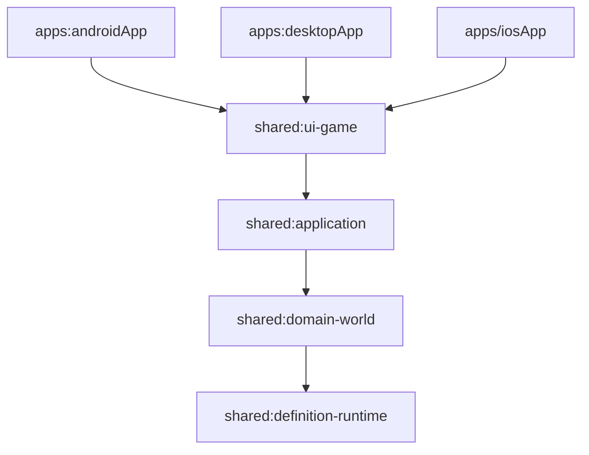

# Worldloom 项目初始化设计

文档状态：In Progress 0.2<br>
更新日期：2026-08-17

## 1. 文档目的

本文定义 Worldloom 从“设计基线仓库”进入“可构建工程”的首个初始化增量。目标不是一次建立完整目标架构，而是形成一个可持续演进、可在 Android、iOS 与 Desktop 复用的最小工程骨架，并用一条可执行竖切尽早验证最重要的架构约束。

本文受以下已接受决策和设计基线约束：

- [项目设计文档](DESIGN.md)；
- [ADR-0001：选择 Kotlin 与 Compose Multiplatform](decisions/0001-compose-multiplatform.md)；
- [ADR-0002：世界配置与程序代码边界](decisions/0002-world-configuration-boundary.md)。

如果初始化实现与上述文档冲突，以 Accepted ADR 为最高优先级。本文不改变既有架构决策，只把下一阶段收敛为可验收的工程范围。

当前实现已建立本文定义的 Gradle/KMP 基座、权威世界竖切、双题材契约夹具、application session、共享 Compose UI 与三个平台入口。Desktop 和 Android 已在 Windows 完成编译验证；iOS 宿主需要由 macOS CI 或开发机完成最终验证。

## 2. 初始化目标

首个工程增量必须同时达到以下目标：

1. 建立由仓库内 Gradle Wrapper 驱动的 Kotlin Multiplatform 工程；
2. Android、iOS 与 Desktop 使用相同的领域模型和主要 Compose UI；
3. 领域与 Runtime 核心只依赖纯 Kotlin、协程和序列化能力，不依赖 Compose 或平台 API；
4. 实现一条最小的 `GameCommand → CommandValidator → WorldEngine → GameEvent → EventStore/Reducer → GameState` 链路；
5. 从 Definition 和表现绑定生成只读 UI 投影，不在 UI 中读取题材字段；
6. 使用 `war-survival` 与 `station-ai` 两个最小契约夹具证明 Runtime 不按题材、`worldId` 或特定 `DefinitionId` 分支；
7. 在 Windows 开发环境完成 Desktop 和 Android 的自动验证，并在 macOS CI 或开发机完成 iOS 编译验证；
8. 为后续增加规则模块、Agent、持久化和世界包加载保留清晰边界，但不提前实现这些完整能力。

初始化完成后，仓库应从“文档可评审”进入“架构约束可由测试执行”的状态。

## 3. 非目标

以下内容不属于初始化增量：

- 接入真实模型 Provider、Agent Loop、Tool Gateway 或上下文压缩；
- 实现 SQLDelight 数据库、正式存档、迁移和崩溃恢复；
- 实现完整 `.worldloom` ZIP 解析、签名、资产或 Behavior AST；
- 实现完整角色创建、检定、背包、关系、任务、日历、战斗等规则模块；
- 实现世界工坊、TXT/EPUB 导入、语音、音效、触觉或复杂动效；
- 建立所有目标模块的空目录或空 Gradle 子项目；
- 固化正式公共 Schema。初始化中的 Schema 必须带版本，并允许在进入首个发布版本前替换；
- 发布安装包、配置商店签名或接入生产密钥。

非目标能力只有在产生实际代码和依赖时才建立模块，避免用空模块模拟架构进度。

## 4. 初始化原则

### 4.1 最小竖切优先

工程骨架必须附带一个能够运行和测试的功能闭环。仅创建目录、Gradle 模块和占位接口不算完成。

### 4.2 权威管线不可绕过

即使初始化 UI 只提供一个开发用操作，事实变化也必须产生类型化 Command 和 Event。UI、用例、Reducer 测试夹具都不能直接修改 `GameState`。

### 4.3 先验证跨题材边界

两个契约夹具使用不同的 Definition、组件、数值和表现绑定。相同 Runtime API 必须加载并操作它们，任何以下实现都视为初始化失败：

- 判断 `worldId == "war-survival"` 或 `worldId == "station-ai"`；
- 在 Runtime 或 UI 中读取 `war.health`、`war.hunger`、`station.energy` 等具体键；
- 为生命、饥饿、能源或带宽建立固定字段或枚举；
- 为未启用的模块注册能力。

### 4.4 平台能力留在边界

首个竖切使用内存实现，不为了“以后需要”而让 JVM 文件 API、Android Context、Apple Framework 或安全存储进入 `commonMain`。需要平台能力时再通过接口或 `expect/actual` 增量接入。

### 4.5 构建可重复

所有开发者和 CI 使用仓库内 Wrapper、统一版本目录和固定工具链。构建不得依赖开发者全局安装的 Gradle，也不得从未声明的仓库动态解析插件或依赖。

## 5. 首期仓库结构

初始化增量采用以下物理结构：

```text
WorldLoom/
├── apps/
│   ├── androidApp/                 # Android 组装与入口
│   ├── desktopApp/                 # Desktop 组装与入口
│   └── iosApp/                     # Xcode 宿主与 iOS 入口
├── shared/
│   ├── definition-runtime/         # DefinitionId、TypedValue 与定义校验
│   ├── domain-world/               # Command、Event、State、Engine、Reducer
│   ├── application/                # 用例、状态流与运行会话编排
│   └── ui-game/                    # 共享 Compose 壳与只读投影 UI
├── contract-worlds/
│   ├── war-survival/               # 测试用最小世界配置
│   └── station-ai/                 # 跨题材测试用最小世界配置
├── gradle/
│   ├── libs.versions.toml
│   └── wrapper/
├── docs/
├── build.gradle.kts
├── settings.gradle.kts
├── gradle.properties
├── gradlew
└── gradlew.bat
```

`contract-worlds/` 是测试夹具和开发演示数据，不发布为独立 Gradle 模块。其文件通过测试资源或应用开发资源加载，不允许被 `domain-world` 的生产代码反向依赖。

首期暂不创建 `rule-module-api`、`rule-module-registry`、`provider-api`、`persistence` 和 `platform/*`。当下一条竖切首次需要对应能力时再引入，并同时增加依赖边界测试。完整目标结构仍以 `DESIGN.md` 第 7 节为准。

### 5.1 Gradle 模块标识

建议使用以下稳定模块路径：

| Gradle 路径 | 插件形态 | 主要产物 |
|---|---|---|
| `:shared:definition-runtime` | Kotlin Multiplatform Library | 纯 Kotlin 定义模型 |
| `:shared:domain-world` | Kotlin Multiplatform Library | 纯 Kotlin 领域与 Runtime 核心 |
| `:shared:application` | Kotlin Multiplatform Library | 跨端用例与 `StateFlow` |
| `:shared:ui-game` | Compose Multiplatform Library | 共享游戏 UI |
| `:apps:androidApp` | Android Application | Android 应用 |
| `:apps:desktopApp` | Kotlin JVM + Compose Desktop | Desktop 应用 |

`apps/iosApp` 由 Xcode 工程承载，不注册为仅含占位代码的 Gradle application 模块。它链接 `shared:ui-game` 导出的 iOS Framework，并负责启动共享根界面。

### 5.2 命名约定

- Maven group：`io.worldloom`；
- Kotlin 根包：`io.worldloom`；
- Android application ID：`io.worldloom.app`；
- iOS bundle identifier：`io.worldloom.app`；
- Desktop 主类位于 `io.worldloom.app.desktop`；
- 测试夹具 ID 使用稳定命名空间，不使用显示名称作为标识。

## 6. 模块职责与依赖方向



允许的依赖方向只有从组装层流向基础层：

- `definition-runtime` 不依赖其他 Worldloom 模块；
- `domain-world` 依赖 `definition-runtime`，不依赖 application、Compose 或平台 API；
- `application` 依赖领域模块，通过接口持有 EventStore 和世界加载器；
- `ui-game` 只向 application 提交用户意图或开发操作，并订阅只读 UI 状态；
- 平台应用只负责组装依赖、生命周期和根窗口，不包含领域规则；
- 契约世界是输入数据，不是 Runtime 依赖。

首期在 Gradle 配置和代码评审中维护这一方向；出现第二个容易误用的边界后，再增加自动化架构测试，不为尚不存在的问题引入额外框架。

## 7. 最小端到端竖切

### 7.1 用户可见行为

三个平台启动后展示一个开发版游戏壳：

1. 选择 `war-survival` 或 `station-ai` 契约夹具；
2. 显示世界标题、一个由 `PresentationDefinition` 绑定的数值条目，以及空或已有的事件时间线；
3. 点击“推进演示状态”触发 application 用例；
4. 用例把开发操作转换为类型化 `AdjustNumericComponentCommand`；
5. Command 经验证后产生 `NumericComponentAdjustedEvent`；
6. Event 先追加到内存 EventStore，再由 Reducer 生成新的 `GameState`；
7. PresentationMapper 依据当前世界的表现绑定产生相同形态的 UI 模型；
8. UI 更新数值并在时间线显示事件摘要。

“推进演示状态”只是验证管线的开发入口，不是正式游戏动作，也不暴露给 Agent Tool。其调用权限固定为本地开发会话，并在进入正式玩家输入竖切时删除或移入开发者模式。

### 7.2 两个契约夹具

两个夹具只需要覆盖初始化竖切所需的最小数据：

| 夹具 | 动态字段示例 | 时间模型 | 表现绑定 |
|---|---|---|---|
| `war-survival` | `war.health`，整数范围 `0..10` | 连续世界时间的占位定义 | “身体状况”绑定到动态组件字段 |
| `station-ai` | `station.energy`，整数范围 `0..100` | 离散 Tick 的占位定义 | “能源储备”绑定到动态组件字段 |

示例 ID 只能出现在契约夹具及断言测试中。生产 Runtime 只接收 `DefinitionId`、类型约束和表现绑定。

`station-ai` 的竖切必须在不创建生命、饥饿、背包、装备、休息、日历和战斗对象的情况下通过。初始化阶段尚未实现模块注册，因此夹具只声明基础 Definition；引入 Module Registry 时再把“未启用模块不注册能力”升级为可执行契约测试。

### 7.3 执行顺序

竖切使用以下明确顺序：

```text
UI 开发操作
→ GameSessionUseCase.perform(action)
→ application 映射为 GameCommand
→ CommandValidator.validate(state, definitions, command)
→ WorldEngine.handle(validatedCommand)
→ EventStore.append(events)
→ StateReducer.reduce(previousState, events)
→ GameSessionState 更新
→ PresentationMapper.map(state, definitions, events)
→ Compose UI 重组
```

若 EventStore 追加失败，不发布新 `GameState`。内存实现也要保留这一事务边界，使后续 SQLDelight 实现可以替换存储而不改变 application API。

### 7.4 回放

初始化竖切必须支持从空初始状态依次归约已追加 Event，得到与当前内存快照相同的 `GameState`。回放只复用 Event，不重新解释 Command，也不引入系统时间或随机数。

## 8. 首期核心模型

### 8.1 DefinitionId 与 TypedValue

`definition-runtime` 首期提供：

- 带命名空间的 `DefinitionId`，格式至少包含一个点分隔的命名空间，例如 `war.health`；
- `TypedValue` 的最小标量集合：Boolean、Integer、Decimal、Text 和 Definition Reference；
- 动态 `ComponentInstance`，字段键和值均经过 Definition 校验；
- 数值范围、必填字段和引用存在性校验；
- 带 `schemaVersion` 的可序列化信封。

列表、对象、时间值和更完整的类型表达式在出现实际使用场景后增加。Decimal 必须采用确定性的表示和运算策略；在策略确定前，不把平台浮点结果写入权威 Event。

### 8.2 Command 与 Event 信封

首期信封至少包含：

```text
CommandEnvelope
├── schemaVersion
├── commandId
├── runId
├── actorId
├── expectedSequence
└── payload

EventEnvelope
├── schemaVersion
├── eventId
├── runId
├── sequence
├── causationId
├── correlationId
└── payload
```

约束如下：

- ID 由边界组件显式提供，Reducer 不自行生成 ID；
- `sequence` 是单个 Run 内严格递增的事实顺序；
- Command 使用 `expectedSequence` 进行最小乐观并发检查；
- Event 记录因果和关联 ID，支持回放与审计；
- 权威结果不依赖 wall-clock 时间；若需要记录接收时间，它只能作为非裁决元数据；
- 未知 `schemaVersion` 必须返回可定位错误，不能静默按当前版本解析。

### 8.3 GameState

初始化状态只包含竖切必需数据：

```text
GameState
├── runId
├── worldDefinitionId
├── lastSequence
├── entities: Map<EntityId, EntityState>
├── variables: Map<DefinitionId, TypedValue>
└── moduleStates: Map<DefinitionId, ModuleState>
```

集合遍历顺序不得参与裁决。任何需要稳定顺序的输出必须显式按稳定 ID 或序列号排序。

### 8.4 错误模型

验证和执行使用结构化错误，不以异常消息作为业务协议。首期至少区分：

- Schema 或类型不匹配；
- Definition 不存在；
- Entity 或组件不存在；
- 数值越界；
- 调用者无权限；
- `expectedSequence` 冲突；
- EventStore 追加失败；
- 不支持的 Schema 版本。

错误包含输入路径、相关 ID 和安全的诊断信息，但不包含密钥、模型正文或私有 Agent 上下文。

## 9. Application 与 UI 状态

`shared:application` 提供平台无关的 `GameSession` 或等价用例边界：

```kotlin
interface GameSession {
    val state: StateFlow<GameSessionUiState>

    suspend fun load(worldId: String): LoadResult
    suspend fun perform(action: GameSessionAction): ActionResult
    suspend fun replay(): ReplayResult
}
```

接口名称可以在实现时调整，但必须保留以下语义：

- 加载、提交和回放是可取消的挂起操作；
- UI 只观察不可变状态；
- UI 提交 application action，不构造领域 Command；
- dispatcher 明确运行在非 UI 线程；
- 同一 Session 内 Command 串行结算；
- UI 不持有可变 `GameState`、EventStore 或 Reducer；
- 失败以可展示状态返回，不用静默默认值掩盖错误。

`shared:ui-game` 首期只实现可访问的基础布局、世界切换、动态数值展示、事件时间线和错误提示。长时间线从一开始使用惰性列表，但不加入动画、图片加载或 Design System 大全。

PresentationMapper 接收 `PresentationDefinition` 与只读领域投影，输出不含领域写能力的 UI 模型。它可以决定标签、顺序和组件类型，不能计算或修改客观事实。

## 10. 构建与依赖管理

### 10.1 工具链基线

- 使用 Gradle Kotlin DSL；
- 只使用仓库内 Gradle Wrapper；
- JVM 与 Android Kotlin 编译使用仓库声明的 Java Toolchain，初始化基线为 JDK 17；
- Android 最低系统为 API 29（Android 10）；
- iOS 最低部署目标为 iOS 17；
- Desktop 首要验证目标为仍受支持的 Windows 11；
- Kotlin、Compose Multiplatform、Android Gradle Plugin、Coroutines 和 Serialization 的确切版本在实现 PR 中依据官方兼容矩阵一起锁定。

版本选择必须形成一个经过验证的组合，不能分别追求每个依赖的最新版本。初始化 PR 记录选择日期、兼容依据和已验证平台。

当前实现锁定的组合为 Gradle 9.6.1、Kotlin 2.4.10、Compose Multiplatform 1.11.1、Android Gradle Plugin 9.3.0、kotlinx.coroutines 1.11.0 与 kotlinx.serialization 1.11.0。Android 使用 compile/target SDK 36 和 min SDK 29；后续升级继续以整组兼容验证为单位。

### 10.2 依赖声明

所有插件和库版本集中在 `gradle/libs.versions.toml`。首期生产依赖仅允许：

- Kotlin 标准库；
- kotlinx.coroutines；
- kotlinx.serialization；
- Compose Multiplatform UI 所需组件；
- AndroidX 中平台壳实际需要的最小依赖。

测试依赖使用 `kotlin.test` 与协程测试库。Ktor、SQLDelight、DI 框架、日志框架和 Schema 框架在首期没有使用者，因此不加入。

依赖仓库只在 `settings.gradle.kts` 统一声明，并拒绝子项目私自增加仓库。Wrapper distribution 校验和、依赖验证或等价的供应链校验应与首次可重复构建一起提交。

### 10.3 Gradle 配置策略

初始化阶段直接使用少量、清晰的模块构建脚本，不立即创建 convention plugin。满足以下任一条件时再引入独立 `build-logic`：

- 三个以上 KMP Library 重复同一段非平凡配置；
- 平台编译选项开始发生漂移；
- 需要集中执行静态检查、发布或二进制兼容策略。

构建从第一天启用合理的并行、缓存和配置缓存验证，但不得以隐藏警告或降低确定性为代价。CI 至少有一条任务使用干净缓存验证完整解析。

## 11. Source Set 与平台组装

### 11.1 共享模块

每个共享模块按实际目标使用以下 source set：

```text
src/
├── commonMain/
├── commonTest/
├── androidMain/        # 只有实际平台实现时创建
├── androidUnitTest/
├── iosMain/            # 共享 iosArm64/iosSimulatorArm64
├── iosTest/
├── desktopMain/
└── desktopTest/
```

不创建空 source set 目录。领域模块的产品代码应全部位于 `commonMain`；如果 `domain-world` 需要平台源集，必须在变更说明中解释原因。

### 11.2 Android

Android app 只负责 Application/Activity、窗口边到边配置、生命周期收集和根 Compose 内容。首期不申请网络、存储、麦克风或通知权限。

### 11.3 iOS

iOS app 由薄 SwiftUI/UIKit 宿主调用共享 Compose `UIViewController`。Xcode 工程和 Gradle Framework 构建必须能在无生产签名的模拟器配置下编译。iOS 专属生命周期适配留在宿主或后续 `platform/lifecycle-windowing`。

### 11.4 Desktop

Desktop app 提供 JVM 主函数、窗口和开发用退出行为。首期不读取用户目录、不保存密钥，也不生成安装包。Desktop 是本地最快的演示入口，但不能拥有 Android/iOS 不共享的领域逻辑。

## 12. 测试设计

### 12.1 纯 Kotlin 单元测试

初始化必须覆盖：

- 合法与非法 `DefinitionId`；
- `TypedValue` 序列化往返和未知版本拒绝；
- 动态组件字段类型、引用和数值边界验证；
- Command 权限、类型、范围与 `expectedSequence` 验证；
- Command 只产生预期 Event；
- Reducer 对同一状态和 Event 产生相同结果；
- Event 回放等于实时归约状态；
- Reducer 不读取系统时间、隐式随机或集合迭代顺序；
- EventStore 追加失败时不发布新状态。

### 12.2 跨题材契约测试

同一参数化测试依次加载两个夹具，并验证：

- 不修改 Runtime 即可解析各自 Definition 和初始实体；
- 同一种通用 Command 能操作各自绑定的动态字段；
- 各自生成合法 Event 并可重放；
- PresentationMapper 使用配置输出正确标签与数值；
- Runtime 源码和序列化模型不存在具体题材字段；
- `station-ai` 不需要战争世界的任何定义文件。

对源码字符串的简单扫描只能作为补充保护，核心保证来自数据驱动的参数化行为测试。

### 12.3 UI 冒烟测试

首期至少验证：

- 根界面能渲染加载中、成功和错误状态；
- 切换契约世界后 UI 标签和数值来自新绑定；
- 点击开发操作后状态和时间线同时更新；
- 1280×720 Desktop 窗口和常见窄屏宽度下无关键内容不可达；
- 减少动态效果设置不影响功能。首期无持续动画时仍保留该状态入口的设计空间。

### 12.4 平台构建验证

骨架加入后，预期稳定命令如下；实现 PR 必须根据最终任务名校正，并同步更新根 `AGENTS.md`：

```powershell
./gradlew.bat check
./gradlew.bat :apps:desktopApp:run
./gradlew.bat :apps:androidApp:assembleDebug
```

macOS CI 或开发机额外执行 iOS 模拟器编译与测试。本文不把尚未存在的任务写成当前可用命令。

## 13. CI 与质量门槛

初始化 PR 同时建立最小 CI：

| Job | 运行环境 | 验证内容 |
|---|---|---|
| `common-check` | Windows 或 Linux | KMP 公共单测、序列化与契约测试 |
| `android-build` | Linux | Android Debug 编译与单元测试 |
| `desktop-build` | Windows | Desktop 编译与测试 |
| `ios-build` | macOS | iOS Simulator Framework 与测试编译 |

合并门槛：

- 所有公共单元测试与契约测试通过；
- Android、Desktop 和 iOS 至少完成编译；
- 无未提交的生成物、签名文件、密钥或本地 SDK 路径；
- Gradle Wrapper、版本目录和依赖验证文件完整；
- 警告基线为空，或每个临时警告都有可追踪原因；
- Markdown 链接与 Mermaid 代码块完整。

若 CI 平台尚未确定，初始化实现可以先提交可本地运行的命令，但不能声称 iOS 已验证；交付说明必须明确列出未验证项。

## 14. 实施顺序

### 阶段 A：构建基座

1. 加入 Wrapper、settings、版本目录和根构建文件；
2. 建立 `definition-runtime` 和 `domain-world`；
3. 配置 `commonMain/commonTest` 与序列化；
4. 使纯 Kotlin 测试在干净环境运行。

验收：无需 UI 或平台 SDK 即可运行核心模型测试。

### 阶段 B：权威竖切

1. 实现最小 Definition、Command、Event、State 与结构化错误；
2. 实现 validator、engine、内存 EventStore 和 reducer；
3. 加入两个契约夹具；
4. 完成实时归约、失败原子性和回放测试。

验收：两个夹具通过同一参数化测试，Runtime 无题材分支。

### 阶段 C：Application 与共享 UI

1. 建立 application session 和只读状态流；
2. 建立 PresentationDefinition 的最小解释器；
3. 建立共享 Compose 根界面；
4. 完成世界切换、开发操作、错误和时间线展示。

验收：Desktop 可运行演示，UI 不直接持有或修改 GameState。

### 阶段 D：平台壳与 CI

1. 接入 Android application；
2. 接入 iOS Xcode 宿主和 Framework；
3. 验证 Desktop 入口；
4. 加入最小 CI、依赖校验和文档命令。

验收：三端编译，Desktop 与 Android 至少完成手工冒烟；iOS 在 macOS 完成模拟器编译。

每个阶段都应保持主分支可构建。若拆分为多个 PR，不得先合入无法由测试证明边界的空架构。

## 15. 初始化完成定义

满足以下条件后，项目初始化才算完成：

- 仓库内 Wrapper 可在干净检出中解析并构建；
- 四个共享模块、Android/Desktop 两个 Gradle 应用和 iOS Xcode 宿主具有真实职责，没有空模块；
- iOS 薄宿主能够链接共享 UI；
- `war-survival` 与 `station-ai` 通过同一 Runtime 竖切；
- 所有事实变化遵循 Command、Event、EventStore、Reducer 管线；
- EventLog 回放可重建相同状态；
- UI 通过表现定义和只读投影展示数据；
- 公共模型不包含题材字段、平台 API 或供应商 DTO；
- 自动测试覆盖确定性、权限、边界、失败原子性与跨题材配置；
- README、`AGENTS.md` 和本设计中的结构与命令已按实际工程同步；
- 交付记录列明 Android、iOS、Desktop 实际验证结果和未验证项。

## 16. 后续增量入口

初始化完成后，优先选择一条新的最小竖切继续扩展，而不是同时铺开全部模块。建议顺序为：

1. 引入 `rule-module-api` 与 Registry，用两个契约世界验证 manifest 驱动的能力注册；
2. 引入 RandomService 和可审计 Random Record，完成可重放的通用检定；
3. 引入 SQLDelight EventStore 和快照，替换内存实现并验证迁移边界；
4. 引入 Provider API、Fake Agent 和最小 Tool Gateway，贯通 Tool→Command→Event；
5. 最后接入真实 Provider、完整世界包、创作管线和平台安全存储。

每一步都必须继续保留两个契约世界，并在出现新的公共 Schema 或重要不可逆决策时同步更新 `DESIGN.md` 或新增 ADR。

## 17. 待实现阶段确认的事项

以下事项有意不在本文中固定：

- Kotlin、Compose、Gradle 和 Android Gradle Plugin 的精确兼容版本；
- iOS Framework 使用静态或动态链接；
- 首个正式 EventStore 的事务与快照实现；
- Decimal 的规范表示；
- 公共 API 的二进制兼容策略；
- 静态检查和格式化工具选择；
- CI 服务与发布签名流程。

这些选择必须基于实现原型、官方兼容信息和目标平台验证作出；一旦影响公共 Schema、平台最低要求、安全边界或长期迁移成本，应记录为 ADR。
